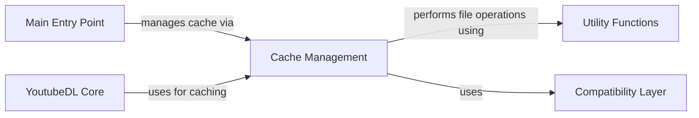

## Component Details

This graph illustrates the role and interactions of the Cache Management component within the youtube-dl project. It highlights how the cache is utilized by the YoutubeDL Core and the Main Entry Point to optimize performance, and how it relies on Utility Functions for underlying file operations and the Compatibility Layer for cross-platform consistency.

### Cache Management
Manages a local filesystem cache for downloaded information and metadata, reducing redundant network requests and improving performance. It provides functionalities to store, load, and clear cached data, relying on utility functions for file operations and compatibility layers for cross-platform support.

**Related Classes/Methods**:

- <a href="https://github.com/ytdl-org/youtube-dl/blob/master/youtube_dl/cache.py#L27-L145" target="_blank" rel="noopener noreferrer">`youtube_dl.cache.Cache` (27:145)</a>
- <a href="https://github.com/ytdl-org/youtube-dl/blob/master/youtube_dl/cache.py#L66-L79" target="_blank" rel="noopener noreferrer">`youtube_dl.cache.Cache:store` (66:79)</a>
- <a href="https://github.com/ytdl-org/youtube-dl/blob/master/youtube_dl/cache.py#L105-L129" target="_blank" rel="noopener noreferrer">`youtube_dl.cache.Cache:load` (105:129)</a>
- <a href="https://github.com/ytdl-org/youtube-dl/blob/master/youtube_dl/cache.py#L81-L95" target="_blank" rel="noopener noreferrer">`youtube_dl.cache.Cache:clear` (81:95)</a>

### YoutubeDL Core
The central orchestrator of the youtube-dl application. It manages the entire video download process, from parsing options and extracting video information to handling downloads and post-processing. It coordinates interactions between various sub-components like extractors, downloaders, and post-processors.

**Related Classes/Methods**:

- <a href="https://github.com/ytdl-org/youtube-dl/blob/master/youtube_dl/YoutubeDL.py#L148-L2722" target="_blank" rel="noopener noreferrer">`youtube_dl.YoutubeDL.YoutubeDL` (148:2722)</a>

### Main Entry Point
This component serves as the primary entry point for the youtube-dl application, handling initial setup, command-line argument parsing, and initiating the core download or update processes. It bridges the command-line interface with the internal logic of the YoutubeDL core.

**Related Classes/Methods**:

- `youtube_dl._real_main` (full file reference)

### Utility Functions
A comprehensive module containing various helper functions used across the entire youtube-dl project. These utilities cover a wide range of tasks including string manipulation, file system operations, network request handling, error formatting, and data parsing.

**Related Classes/Methods**:

- `youtube_dl.utils` (full file reference)

### Compatibility Layer
Provides a set of functions and classes designed to ensure that youtube-dl operates correctly across different Python versions (2 and 3) and various operating systems, abstracting away inconsistencies in standard library modules and system behaviors.

**Related Classes/Methods**:

- `youtube_dl.compat` (full file reference)

### [FAQ](https://github.com/CodeBoarding/GeneratedOnBoardings/tree/main?tab=readme-ov-file#faq)