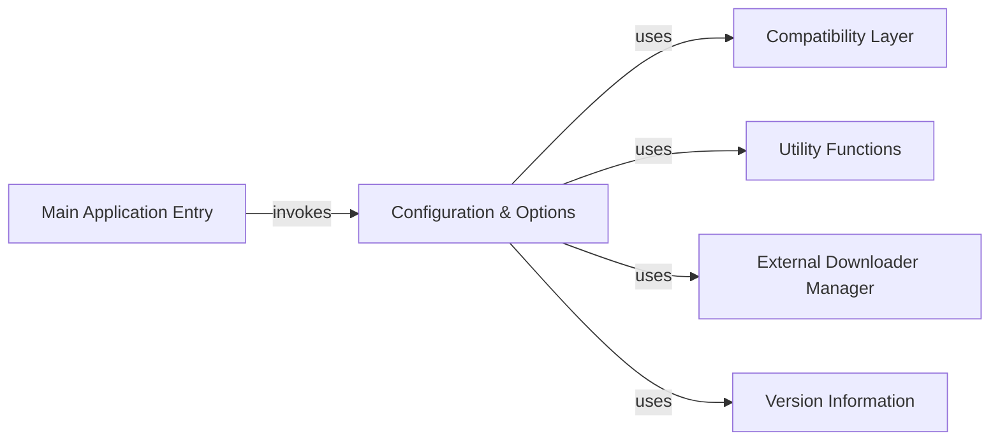

## Component Details

This component overview describes the initial setup and configuration parsing phase of the youtube-dl application. The main application entry point initiates the process, which then delegates to the Configuration & Options component to handle command-line arguments and configuration files. This component relies on a Compatibility Layer for cross-environment functionality, Utility Functions for common operations like encoding, and interacts with the External Downloader Manager to list available external downloaders. Version Information is also accessed during this phase.

### Main Application Entry
The primary entry point of the youtube-dl application, responsible for initiating the option parsing process.

**Related Classes/Methods**:

- `youtube_dl.__main__` (full file reference)

### Configuration & Options
Manages the parsing of command-line arguments and configuration files, translating user inputs into structured application parameters. It reads options from various sources, including user configuration files, and prepares them for the main application logic. It also interacts with utility functions for encoding and compatibility, and lists external downloaders.

**Related Classes/Methods**:

- <a href="https://github.com/ytdl-org/youtube-dl/blob/master/youtube_dl/options.py#L42-L928" target="_blank" rel="noopener noreferrer">`youtube_dl.options.parseOpts` (42:928)</a>
- <a href="https://github.com/ytdl-org/youtube-dl/blob/master/youtube_dl/options.py#L105-L128" target="_blank" rel="noopener noreferrer">`youtube_dl.options._readOptions` (105:128)</a>
- <a href="https://github.com/ytdl-org/youtube-dl/blob/master/youtube_dl/options.py#L130-L135" target="_blank" rel="noopener noreferrer">`youtube_dl.options.compat_conf` (130:135)</a>
- <a href="https://github.com/ytdl-org/youtube-dl/blob/master/youtube_dl/options.py#L137-L158" target="_blank" rel="noopener noreferrer">`youtube_dl.options._readUserConf` (137:158)</a>
- <a href="https://github.com/ytdl-org/youtube-dl/blob/master/youtube_dl/options.py#L24-L39" target="_blank" rel="noopener noreferrer">`youtube_dl.options._hide_login_info` (24:39)</a>

### Compatibility Layer
Provides compatibility functions to handle differences across Python versions or environments, particularly for file operations and argument parsing workarounds.

**Related Classes/Methods**:

- <a href="https://github.com/ytdl-org/youtube-dl/blob/master/youtube_dl/compat.py#L10-L13" target="_blank" rel="noopener noreferrer">`youtube_dl.compat.compat_open` (10:13)</a>
- <a href="https://github.com/ytdl-org/youtube-dl/blob/master/youtube_dl/compat.py#L15-L18" target="_blank" rel="noopener noreferrer">`youtube_dl.compat.compat_kwargs` (15:18)</a>
- <a href="https://github.com/ytdl-org/youtube-dl/blob/master/youtube_dl/compat.py#L20-L23" target="_blank" rel="noopener noreferrer">`youtube_dl.compat._workaround_optparse_bug9161._compat_add_option` (20:23)</a>

### Utility Functions
Offers various utility functions, such as determining preferred encoding and writing strings, which are used across different parts of the youtube-dl application.

**Related Classes/Methods**:

- <a href="https://github.com/ytdl-org/youtube-dl/blob/master/youtube_dl/utils.py#L1794-L1806" target="_blank" rel="noopener noreferrer">`youtube_dl.utils.preferredencoding` (1794:1806)</a>
- <a href="https://github.com/ytdl-org/youtube-dl/blob/master/youtube_dl/utils.py#L3404-L3423" target="_blank" rel="noopener noreferrer">`youtube_dl.utils.write_string` (3404:3423)</a>

### External Downloader Manager
Responsible for listing and potentially managing external downloaders that youtube-dl can utilize.

**Related Classes/Methods**:

- <a href="https://github.com/ytdl-org/youtube-dl/blob/master/youtube_dl/downloader/external.py#L527-L528" target="_blank" rel="noopener noreferrer">`youtube_dl.downloader.external.list_external_downloaders` (527:528)</a>

### Version Information
Provides access to the version information of the youtube-dl application.

**Related Classes/Methods**:

- `youtube_dl.version` (full file reference)

### [FAQ](https://github.com/CodeBoarding/GeneratedOnBoardings/tree/main?tab=readme-ov-file#faq)