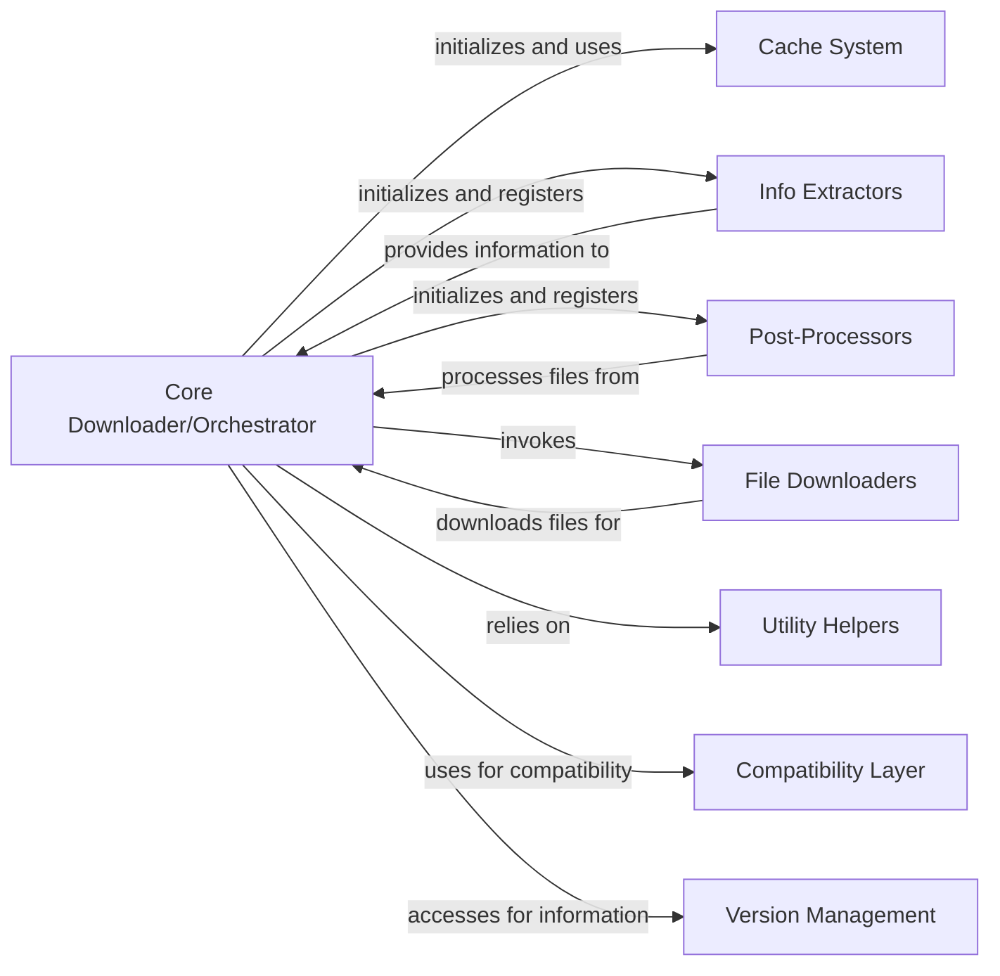

## Component Details

This graph illustrates the core components of youtube-dl, focusing on the central orchestration of the download process. The Core Downloader/Orchestrator acts as the main entry point, managing configurations, interacting with Info Extractors to retrieve video information, utilizing File Downloaders for content acquisition, and applying Post-Processors for final file manipulations. It relies heavily on Utility Helpers for common tasks, uses the Cache System for performance, and leverages the Compatibility Layer for cross-version support. Version Management provides application version details.

### Core Downloader/Orchestrator
The central orchestrator of youtube-dl. It initializes the download process, loads configurations, manages information extractors, applies post-processors, and handles overall program flow, error reporting, and user interaction. It acts as the main entry point and coordinates all major operations.

**Related Classes/Methods**:

- `youtube_dl.youtube_dl.YoutubeDL` (full file reference)
- `youtube_dl.youtube_dl.YoutubeDL:__init__` (158:210)
- `youtube_dl.youtube_dl.YoutubeDL:extract_info` (340:366)
- `youtube_dl.youtube_dl.YoutubeDL:download` (809:830)
- `youtube_dl.youtube_dl.YoutubeDL:process_ie_result` (401:468)
- `youtube_dl.youtube_dl.YoutubeDL:post_process` (860:878)
- `youtube_dl.youtube_dl.YoutubeDL:warn_if_short_id` (full file reference)
- `youtube_dl.youtube_dl.YoutubeDL:add_info_extractor` (full file reference)
- `youtube_dl.youtube_dl.YoutubeDL:get_info_extractor` (full file reference)
- `youtube_dl.youtube_dl.YoutubeDL:add_default_info_extractors` (full file reference)
- `youtube_dl.youtube_dl.YoutubeDL:add_post_processor` (full file reference)
- `youtube_dl.youtube_dl.YoutubeDL:add_progress_hook` (full file reference)
- `youtube_dl.youtube_dl.YoutubeDL:_bidi_workaround` (full file reference)
- `youtube_dl.youtube_dl.YoutubeDL:to_screen` (full file reference)
- `youtube_dl.youtube_dl.YoutubeDL:_write_string` (full file reference)
- `youtube_dl.youtube_dl.YoutubeDL:to_stdout` (full file reference)
- `youtube_dl.youtube_dl.YoutubeDL:to_stderr` (full file reference)
- `youtube_dl.youtube_dl.YoutubeDL:to_console_title` (full file reference)
- `youtube_dl.youtube_dl.YoutubeDL:save_console_title` (full file reference)
- `youtube_dl.youtube_dl.YoutubeDL:restore_console_title` (full file reference)
- `youtube_dl.youtube_dl.YoutubeDL:trouble` (full file reference)
- `youtube_dl.youtube_dl.YoutubeDL:report_warning` (full file reference)
- `youtube_dl.youtube_dl.YoutubeDL:report_error` (full file reference)
- `youtube_dl.youtube_dl.YoutubeDL:write_debug` (full file reference)
- `youtube_dl.youtube_dl.YoutubeDL:report_unscoped_cookies` (full file reference)
- `youtube_dl.youtube_dl.YoutubeDL:report_file_already_downloaded` (full file reference)
- `youtube_dl.youtube_dl.YoutubeDL:prepare_filename` (full file reference)
- `youtube_dl.youtube_dl.YoutubeDL:_match_entry` (full file reference)
- `youtube_dl.youtube_dl.YoutubeDL:add_extra_info` (full file reference)
- `youtube_dl.youtube_dl.YoutubeDL:__handle_extraction_exceptions` (full file reference)
- `youtube_dl.youtube_dl.YoutubeDL:_remove_cookie_header` (full file reference)
- `youtube_dl.youtube_dl.YoutubeDL:_load_cookies` (full file reference)
- `youtube_dl.youtube_dl.YoutubeDL:_load_cookies_from_headers` (full file reference)
- `youtube_dl.youtube_dl.YoutubeDL:_apply_header_cookies` (full file reference)
- `youtube_dl.youtube_dl.YoutubeDL:__extract_info` (full file reference)
- `youtube_dl.youtube_dl.YoutubeDL:add_default_extra_info` (full file reference)
- `youtube_dl.youtube_dl.YoutubeDL:__process_playlist` (full file reference)
- `youtube_dl.youtube_dl.YoutubeDL:__process_iterable_entry` (full file reference)
- `youtube_dl.youtube_dl.YoutubeDL:_build_format_filter` (full file reference)
- `youtube_dl.youtube_dl.YoutubeDL:_default_format_spec` (full file reference)
- `youtube_dl.youtube_dl.YoutubeDL:build_format_selector` (full file reference)
- `youtube_dl.youtube_dl.YoutubeDL:_calc_headers` (full file reference)
- `youtube_dl.youtube_dl.YoutubeDL:_calc_cookies` (full file reference)
- `youtube_dl.youtube_dl.YoutubeDL:_fill_common_fields` (full file reference)
- `youtube_dl.youtube_dl.YoutubeDL:process_video_result` (full file reference)
- `youtube_dl.youtube_dl.YoutubeDL:process_subtitles` (full file reference)
- `youtube_dl.youtube_dl.YoutubeDL:__forced_printings` (full file reference)
- `youtube_dl.youtube_dl.YoutubeDL:process_info` (full file reference)
- `youtube_dl.youtube_dl.YoutubeDL:download_with_info_file` (full file reference)
- `youtube_dl.youtube_dl.YoutubeDL:sanitize_info` (full file reference)
- `youtube_dl.youtube_dl.YoutubeDL:filter_requested_info` (full file reference)
- `youtube_dl.youtube_dl.YoutubeDL:_make_archive_id` (full file reference)
- `youtube_dl.youtube_dl.YoutubeDL:in_download_archive` (full file reference)
- `youtube_dl.youtube_dl.YoutubeDL:record_download_archive` (full file reference)
- `youtube_dl.youtube_dl.YoutubeDL:format_resolution` (full file reference)
- `youtube_dl.youtube_dl.YoutubeDL:_format_note` (full file reference)
- `youtube_dl.youtube_dl.YoutubeDL:list_formats` (full file reference)
- `youtube_dl.youtube_dl.YoutubeDL:list_thumbnails` (full file reference)
- `youtube_dl.youtube_dl.YoutubeDL:list_subtitles` (full file reference)
- `youtube_dl.youtube_dl.YoutubeDL:urlopen` (full file reference)
- `youtube_dl.youtube_dl.YoutubeDL:print_debug_header` (full file reference)
- `youtube_dl.youtube_dl.YoutubeDL:_setup_opener` (full file reference)
- `youtube_dl.youtube_dl.YoutubeDL:encode` (full file reference)
- `youtube_dl.youtube_dl.YoutubeDL:get_encoding` (full file reference)
- `youtube_dl.youtube_dl.YoutubeDL:_write_info_json` (full file reference)
- `youtube_dl.youtube_dl.YoutubeDL:_write_thumbnails` (full file reference)

### Info Extractors
This component is responsible for identifying and extracting metadata and download URLs from various video hosting websites. It provides a pluggable mechanism for adding support for new sites.

**Related Classes/Methods**:

- `youtube_dl.extractor.get_info_extractor` (full file reference)
- `youtube_dl.extractor.gen_extractor_classes` (full file reference)
- `youtube_dl.extractor._LAZY_LOADER` (full file reference)
- <a href="https://github.com/ytdl-org/youtube-dl/blob/master/youtube_dl/extractor/openload.py#L56-L240" target="_blank" rel="noopener noreferrer">`youtube_dl.extractor.openload.PhantomJSwrapper` (56:240)</a>
- <a href="https://github.com/ytdl-org/youtube-dl/blob/master/youtube_dl/extractor/common.py#L98-L3361" target="_blank" rel="noopener noreferrer">`youtube_dl.extractor.common.InfoExtractor` (98:3361)</a>

### Post-Processors
This component handles operations performed on the downloaded video files, such as merging audio and video streams, fixing common issues (e.g., stretched video, malformed audio), and embedding metadata.

**Related Classes/Methods**:

- `youtube_dl.postprocessor.get_postprocessor` (full file reference)
- `youtube_dl.postprocessor.FFmpegFixupM3u8PP` (full file reference)
- `youtube_dl.postprocessor.FFmpegFixupM4aPP` (full file reference)
- `youtube_dl.postprocessor.FFmpegFixupStretchedPP` (full file reference)
- `youtube_dl.postprocessor.FFmpegMergerPP` (full file reference)
- `youtube_dl.postprocessor.FFmpegPostProcessor` (full file reference)
- <a href="https://github.com/ytdl-org/youtube-dl/blob/master/youtube_dl/postprocessor/common.py#L12-L65" target="_blank" rel="noopener noreferrer">`youtube_dl.postprocessor.common.PostProcessor` (12:65)</a>

### File Downloaders
This component is responsible for the actual downloading of video and audio files from the internet, supporting various protocols and external downloaders.

**Related Classes/Methods**:

- `youtube_dl.downloader.get_suitable_downloader` (full file reference)
- <a href="https://github.com/ytdl-org/youtube-dl/blob/master/youtube_dl/downloader/rtmp.py#L18-L20" target="_blank" rel="noopener noreferrer">`youtube_dl.downloader.rtmp.rtmpdump_version` (18:20)</a>
- <a href="https://github.com/ytdl-org/youtube-dl/blob/master/youtube_dl/downloader/common.py#L20-L405" target="_blank" rel="noopener noreferrer">`youtube_dl.downloader.common.FileDownloader` (20:405)</a>

### Utility Helpers
This component provides a collection of general-purpose utility functions and custom exception classes used throughout the youtube-dl application for tasks like string manipulation, file system operations, network handling, and error management.

**Related Classes/Methods**:

- <a href="https://github.com/ytdl-org/youtube-dl/blob/master/youtube_dl/utils.py#L2454-L2460" target="_blank" rel="noopener noreferrer">`youtube_dl.utils.SameFileError` (2454:2460)</a>
- <a href="https://github.com/ytdl-org/youtube-dl/blob/master/youtube_dl/utils.py#L2148-L2163" target="_blank" rel="noopener noreferrer">`youtube_dl.utils.sanitize_url` (2148:2163)</a>
- `youtube_dl.utils.encodeFilename` (full file reference)
- <a href="https://github.com/ytdl-org/youtube-dl/blob/master/youtube_dl/utils.py#L3801-L3803" target="_blank" rel="noopener noreferrer">`youtube_dl.utils.url_basename` (3801:3803)</a>
- <a href="https://github.com/ytdl-org/youtube-dl/blob/master/youtube_dl/utils.py#L87-L93" target="_blank" rel="noopener noreferrer">`youtube_dl.utils.register_socks_protocols` (87:93)</a>
- <a href="https://github.com/ytdl-org/youtube-dl/blob/master/youtube_dl/utils.py#L4654-L4655" target="_blank" rel="noopener noreferrer">`youtube_dl.utils.error_to_compat_str` (4654:4655)</a>
- <a href="https://github.com/ytdl-org/youtube-dl/blob/master/youtube_dl/utils.py#L2362-L2379" target="_blank" rel="noopener noreferrer">`youtube_dl.utils.bug_reports_message` (2362:2379)</a>
- <a href="https://github.com/ytdl-org/youtube-dl/blob/master/youtube_dl/utils.py#L2489-L2503" target="_blank" rel="noopener noreferrer">`youtube_dl.utils.ContentTooShortError` (2489:2503)</a>
- <a href="https://github.com/ytdl-org/youtube-dl/blob/master/youtube_dl/utils.py#L2440-L2451" target="_blank" rel="noopener noreferrer">`youtube_dl.utils.DownloadError` (2440:2451)</a>
- <a href="https://github.com/ytdl-org/youtube-dl/blob/master/youtube_dl/utils.py#L2387-L2413" target="_blank" rel="noopener noreferrer">`youtube_dl.utils.ExtractorError` (2387:2413)</a>
- <a href="https://github.com/ytdl-org/youtube-dl/blob/master/youtube_dl/utils.py#L2428-L2437" target="_blank" rel="noopener noreferrer">`youtube_dl.utils.GeoRestrictedError` (2428:2437)</a>
- <a href="https://github.com/ytdl-org/youtube-dl/blob/master/youtube_dl/utils.py#L2475-L2477" target="_blank" rel="noopener noreferrer">`youtube_dl.utils.MaxDownloadsReached` (2475:2477)</a>
- <a href="https://github.com/ytdl-org/youtube-dl/blob/master/youtube_dl/utils.py#L2463-L2472" target="_blank" rel="noopener noreferrer">`youtube_dl.utils.PostProcessingError` (2463:2472)</a>
- <a href="https://github.com/ytdl-org/youtube-dl/blob/master/youtube_dl/utils.py#L2480-L2486" target="_blank" rel="noopener noreferrer">`youtube_dl.utils.UnavailableVideoError` (2480:2486)</a>
- <a href="https://github.com/ytdl-org/youtube-dl/blob/master/youtube_dl/utils.py#L5308-L5565" target="_blank" rel="noopener noreferrer">`youtube_dl.utils.ISO3166Utils` (5308:5565)</a>
- <a href="https://github.com/ytdl-org/youtube-dl/blob/master/youtube_dl/utils.py#L3288-L3320" target="_blank" rel="noopener noreferrer">`youtube_dl.utils.DateRange` (3288:3320)</a>
- <a href="https://github.com/ytdl-org/youtube-dl/blob/master/youtube_dl/utils.py#L3834-L3844" target="_blank" rel="noopener noreferrer">`youtube_dl.utils.int_or_none` (3834:3844)</a>
- <a href="https://github.com/ytdl-org/youtube-dl/blob/master/youtube_dl/utils.py#L6547-L6555" target="_blank" rel="noopener noreferrer">`youtube_dl.utils.join_nonempty` (6547:6555)</a>
- <a href="https://github.com/ytdl-org/youtube-dl/blob/master/youtube_dl/utils.py#L3516-L3544" target="_blank" rel="noopener noreferrer">`youtube_dl.utils.locked_file` (3516:3544)</a>
- <a href="https://github.com/ytdl-org/youtube-dl/blob/master/youtube_dl/utils.py#L2322-L2359" target="_blank" rel="noopener noreferrer">`youtube_dl.utils.make_HTTPS_handler` (2322:2359)</a>
- <a href="https://github.com/ytdl-org/youtube-dl/blob/master/youtube_dl/utils.py#L2195-L2201" target="_blank" rel="noopener noreferrer">`youtube_dl.utils.orderedSet` (2195:2201)</a>
- <a href="https://github.com/ytdl-org/youtube-dl/blob/master/youtube_dl/utils.py#L3606-L3674" target="_blank" rel="noopener noreferrer">`youtube_dl.utils.parse_filesize` (3606:3674)</a>
- <a href="https://github.com/ytdl-org/youtube-dl/blob/master/youtube_dl/utils.py#L3323-L3326" target="_blank" rel="noopener noreferrer">`youtube_dl.utils.platform_name` (3323:3326)</a>
- <a href="https://github.com/ytdl-org/youtube-dl/blob/master/youtube_dl/utils.py#L1794-L1806" target="_blank" rel="noopener noreferrer">`youtube_dl.utils.preferredencoding` (1794:1806)</a>
- <a href="https://github.com/ytdl-org/youtube-dl/blob/master/youtube_dl/utils.py#L2245-L2251" target="_blank" rel="noopener noreferrer">`youtube_dl.utils.process_communicate_or_kill` (2245:2251)</a>
- <a href="https://github.com/ytdl-org/youtube-dl/blob/master/youtube_dl/utils.py#L2085-L2127" target="_blank" rel="noopener noreferrer">`youtube_dl.utils.sanitize_filename` (2085:2127)</a>
- <a href="https://github.com/ytdl-org/youtube-dl/blob/master/youtube_dl/utils.py#L2130-L2145" target="_blank" rel="noopener noreferrer">`youtube_dl.utils.sanitize_path` (2130:2145)</a>
- <a href="https://github.com/ytdl-org/youtube-dl/blob/master/youtube_dl/utils.py#L2178-L2187" target="_blank" rel="noopener noreferrer">`youtube_dl.utils.sanitized_Request` (2178:2187)</a>
- `youtube_dl.utils.std_headers` (full file reference)
- <a href="https://github.com/ytdl-org/youtube-dl/blob/master/youtube_dl/utils.py#L3847-L3848" target="_blank" rel="noopener noreferrer">`youtube_dl.utils.str_or_none` (3847:3848)</a>
- <a href="https://github.com/ytdl-org/youtube-dl/blob/master/youtube_dl/utils.py#L3245-L3246" target="_blank" rel="noopener noreferrer">`youtube_dl.utils.subtitles_filename` (3245:3246)</a>
- <a href="https://github.com/ytdl-org/youtube-dl/blob/master/youtube_dl/utils.py#L6249-L6535" target="_blank" rel="noopener noreferrer">`youtube_dl.utils.traverse_obj` (6249:6535)</a>
- <a href="https://github.com/ytdl-org/youtube-dl/blob/master/youtube_dl/utils.py#L2900-L3028" target="_blank" rel="noopener noreferrer">`youtube_dl.utils.YoutubeDLCookieJar` (2900:3028)</a>
- <a href="https://github.com/ytdl-org/youtube-dl/blob/master/youtube_dl/utils.py#L3031-L3052" target="_blank" rel="noopener noreferrer">`youtube_dl.utils.YoutubeDLCookieProcessor` (3031:3052)</a>
- <a href="https://github.com/ytdl-org/youtube-dl/blob/master/youtube_dl/utils.py#L2601-L2829" target="_blank" rel="noopener noreferrer">`youtube_dl.utils.YoutubeDLHandler` (2601:2829)</a>
- <a href="https://github.com/ytdl-org/youtube-dl/blob/master/youtube_dl/utils.py#L3055-L3122" target="_blank" rel="noopener noreferrer">`youtube_dl.utils.YoutubeDLRedirectHandler` (3055:3122)</a>
- <a href="https://github.com/ytdl-org/youtube-dl/blob/master/youtube_dl/utils.py#L4642-L4646" target="_blank" rel="noopener noreferrer">`youtube_dl.utils.ytdl_is_updateable` (4642:4646)</a>
- <a href="https://github.com/ytdl-org/youtube-dl/blob/master/youtube_dl/utils.py#L3232-L3242" target="_blank" rel="noopener noreferrer">`youtube_dl.utils.determine_ext` (3232:3242)</a>
- <a href="https://github.com/ytdl-org/youtube-dl/blob/master/youtube_dl/utils.py#L4775-L4794" target="_blank" rel="noopener noreferrer">`youtube_dl.utils.determine_protocol` (4775:4794)</a>
- <a href="https://github.com/ytdl-org/youtube-dl/blob/master/youtube_dl/utils.py#L3581-L3592" target="_blank" rel="noopener noreferrer">`youtube_dl.utils.format_bytes` (3581:3592)</a>
- <a href="https://github.com/ytdl-org/youtube-dl/blob/master/youtube_dl/utils.py#L2313-L2319" target="_blank" rel="noopener noreferrer">`youtube_dl.utils.formatSeconds` (2313:2319)</a>
- <a href="https://github.com/ytdl-org/youtube-dl/blob/master/youtube_dl/utils.py#L4797-L4802" target="_blank" rel="noopener noreferrer">`youtube_dl.utils.render_table` (4797:4802)</a>
- <a href="https://github.com/ytdl-org/youtube-dl/blob/master/youtube_dl/utils.py#L1809-L1859" target="_blank" rel="noopener noreferrer">`youtube_dl.utils.write_json_file` (1809:1859)</a>
- <a href="https://github.com/ytdl-org/youtube-dl/blob/master/youtube_dl/utils.py#L3404-L3423" target="_blank" rel="noopener noreferrer">`youtube_dl.utils.write_string` (3404:3423)</a>
- <a href="https://github.com/ytdl-org/youtube-dl/blob/master/youtube_dl/utils.py#L2190-L2192" target="_blank" rel="noopener noreferrer">`youtube_dl.utils.expand_path` (2190:2192)</a>
- `youtube_dl.utils.replace_extension` (full file reference)
- `youtube_dl.utils.prepend_extension` (full file reference)
- <a href="https://github.com/ytdl-org/youtube-dl/blob/master/youtube_dl/utils.py#L4649-L4651" target="_blank" rel="noopener noreferrer">`youtube_dl.utils.args_to_str` (4649:4651)</a>
- <a href="https://github.com/ytdl-org/youtube-dl/blob/master/youtube_dl/utils.py#L4745-L4752" target="_blank" rel="noopener noreferrer">`youtube_dl.utils.age_restricted` (4745:4752)</a>
- <a href="https://github.com/ytdl-org/youtube-dl/blob/master/youtube_dl/utils.py#L6591-L6721" target="_blank" rel="noopener noreferrer">`youtube_dl.utils._UnsafeExtensionError` (6591:6721)</a>

### Cache System
This component manages the caching of data to improve performance and reduce redundant network requests.

**Related Classes/Methods**:

- <a href="https://github.com/ytdl-org/youtube-dl/blob/master/youtube_dl/cache.py#L27-L145" target="_blank" rel="noopener noreferrer">`youtube_dl.cache.Cache` (27:145)</a>

### Compatibility Layer
This component provides functions and classes to ensure compatibility across different Python versions, abstracting away differences in standard library modules and built-in types.

**Related Classes/Methods**:

- `youtube_dl.compat.compat_kwargs` (full file reference)
- `youtube_dl.compat.compat_basestring` (full file reference)
- `youtube_dl.compat.compat_collections_chain_map` (full file reference)
- `youtube_dl.compat.compat_filter` (full file reference)
- `youtube_dl.compat.compat_get_terminal_size` (full file reference)
- `youtube_dl.compat.compat_http_client` (full file reference)
- `youtube_dl.compat.compat_http_cookiejar_Cookie` (full file reference)
- `youtube_dl.compat.compat_http_cookies_SimpleCookie` (full file reference)
- `youtube_dl.compat.compat_integer_types` (full file reference)
- `youtube_dl.compat.compat_map` (full file reference)
- `youtube_dl.compat.compat_numeric_types` (full file reference)
- `youtube_dl.compat.compat_open` (full file reference)
- `youtube_dl.compat.compat_os_name` (full file reference)
- `youtube_dl.compat.compat_str` (full file reference)
- `youtube_dl.compat.compat_tokenize_tokenize` (full file reference)
- `youtube_dl.compat.compat_urllib_error` (full file reference)
- `youtube_dl.compat.compat_urllib_parse` (full file reference)
- `youtube_dl.compat.compat_urllib_request` (full file reference)
- `youtube_dl.compat.compat_urllib_request_DataHandler` (full file reference)

### Version Management
This component provides access to the application's version information, used for debugging and update checks.

**Related Classes/Methods**:

- `youtube_dl.version.__version__` (full file reference)

### [FAQ](https://github.com/CodeBoarding/GeneratedOnBoardings/tree/main?tab=readme-ov-file#faq)