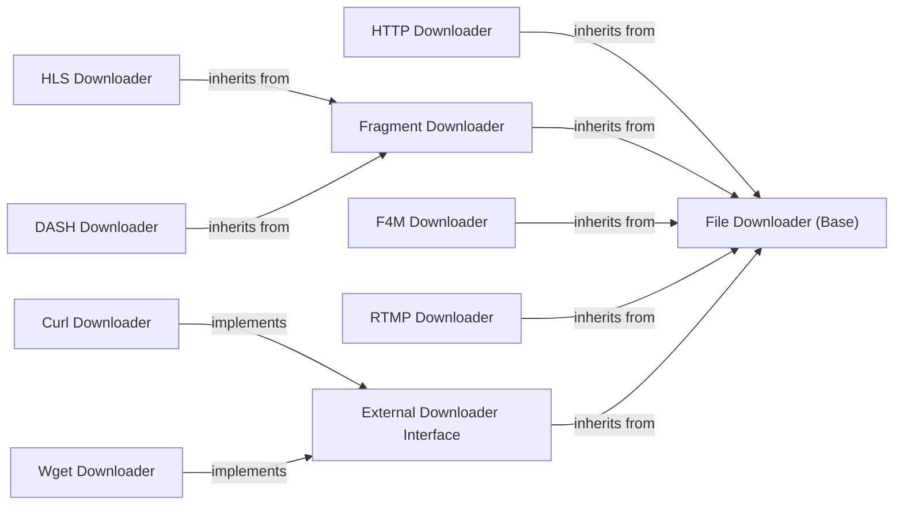

## Component Details

The Download Management component in youtube-dl is a sophisticated subsystem responsible for the core task of retrieving video and audio content from various online sources. It employs a modular design, with a common base downloader providing fundamental functionalities like progress tracking, temporary file management, and error handling. Specialized downloaders extend this base to support diverse streaming protocols such as HTTP, HLS, DASH, F4M, and RTMP, each tailored to handle the specific intricacies of these formats, including fragmented downloads. Furthermore, the component offers an extensible interface for integrating external download tools like Curl and Wget, enhancing its versatility and robustness in handling different download scenarios and network conditions.

### File Downloader (Base)
Provides the foundational functionalities for all downloaders, including progress reporting, temporary file handling, and file renaming.

**Related Classes/Methods**:

- <a href="https://github.com/ytdl-org/youtube-dl/blob/master/youtube_dl/downloader/common.py#L20-L405" target="_blank" rel="noopener noreferrer">`youtube_dl.downloader.common.FileDownloader` (20:405)</a>
- <a href="https://github.com/ytdl-org/youtube-dl/blob/master/youtube_dl/downloader/common.py#L382-L384" target="_blank" rel="noopener noreferrer">`youtube_dl.downloader.common.FileDownloader:real_download` (382:384)</a>
- <a href="https://github.com/ytdl-org/youtube-dl/blob/master/youtube_dl/downloader/common.py#L258-L316" target="_blank" rel="noopener noreferrer">`youtube_dl.downloader.common.FileDownloader:report_progress` (258:316)</a>
- <a href="https://github.com/ytdl-org/youtube-dl/blob/master/youtube_dl/downloader/common.py#L193-L198" target="_blank" rel="noopener noreferrer">`youtube_dl.downloader.common.FileDownloader:temp_name` (193:198)</a>
- <a href="https://github.com/ytdl-org/youtube-dl/blob/master/youtube_dl/downloader/common.py#L208-L214" target="_blank" rel="noopener noreferrer">`youtube_dl.downloader.common.FileDownloader:try_rename` (208:214)</a>

### HTTP Downloader
Handles standard HTTP/HTTPS downloads, managing direct file transfers.

**Related Classes/Methods**:

- <a href="https://github.com/ytdl-org/youtube-dl/blob/master/youtube_dl/downloader/http.py#L27-L362" target="_blank" rel="noopener noreferrer">`youtube_dl.downloader.http.HttpFD` (27:362)</a>
- <a href="https://github.com/ytdl-org/youtube-dl/blob/master/youtube_dl/downloader/http.py#L28-L362" target="_blank" rel="noopener noreferrer">`youtube_dl.downloader.http.HttpFD:real_download` (28:362)</a>

### Fragment Downloader
Manages the downloading and reassembly of fragmented media streams.

**Related Classes/Methods**:

- <a href="https://github.com/ytdl-org/youtube-dl/blob/master/youtube_dl/downloader/fragment.py#L22-L295" target="_blank" rel="noopener noreferrer">`youtube_dl.downloader.fragment.FragmentFD` (22:295)</a>
- <a href="https://github.com/ytdl-org/youtube-dl/blob/master/youtube_dl/downloader/fragment.py#L98-L120" target="_blank" rel="noopener noreferrer">`youtube_dl.downloader.fragment.FragmentFD:_download_fragment` (98:120)</a>
- <a href="https://github.com/ytdl-org/youtube-dl/blob/master/youtube_dl/downloader/fragment.py#L122-L131" target="_blank" rel="noopener noreferrer">`youtube_dl.downloader.fragment.FragmentFD:_append_fragment` (122:131)</a>
- <a href="https://github.com/ytdl-org/youtube-dl/blob/master/youtube_dl/downloader/fragment.py#L68-L70" target="_blank" rel="noopener noreferrer">`youtube_dl.downloader.fragment.FragmentFD:_prepare_and_start_frag_download` (68:70)</a>

### HLS Downloader
Specialized downloader for HTTP Live Streaming (HLS) protocol.

**Related Classes/Methods**:

- <a href="https://github.com/ytdl-org/youtube-dl/blob/master/youtube_dl/downloader/hls.py#L25-L216" target="_blank" rel="noopener noreferrer">`youtube_dl.downloader.hls.HlsFD` (25:216)</a>
- <a href="https://github.com/ytdl-org/youtube-dl/blob/master/youtube_dl/downloader/hls.py#L60-L216" target="_blank" rel="noopener noreferrer">`youtube_dl.downloader.hls.HlsFD:real_download` (60:216)</a>

### DASH Downloader
Specialized downloader for Dynamic Adaptive Streaming over HTTP (DASH) protocol.

**Related Classes/Methods**:

- `youtube_dl.downloader.dash.DashFD` (full file reference)
- <a href="https://github.com/ytdl-org/youtube-dl/blob/master/youtube_dl/downloader/dash.py#L20-L83" target="_blank" rel="noopener noreferrer">`youtube_dl.downloader.dash.DashSegmentsFD:real_download` (20:83)</a>

### F4M Downloader
Specialized downloader for Adobe Flash Media Manifest (F4M) streams.

**Related Classes/Methods**:

- <a href="https://github.com/ytdl-org/youtube-dl/blob/master/youtube_dl/downloader/f4m.py#L259-L438" target="_blank" rel="noopener noreferrer">`youtube_dl.downloader.f4m.F4mFD` (259:438)</a>
- <a href="https://github.com/ytdl-org/youtube-dl/blob/master/youtube_dl/downloader/f4m.py#L319-L438" target="_blank" rel="noopener noreferrer">`youtube_dl.downloader.f4m.F4mFD:real_download` (319:438)</a>
- <a href="https://github.com/ytdl-org/youtube-dl/blob/master/youtube_dl/downloader/f4m.py#L178-L181" target="_blank" rel="noopener noreferrer">`youtube_dl.downloader.f4m.FlvReader:read_bootstrap_info` (178:181)</a>

### RTMP Downloader
Specialized downloader for Real-Time Messaging Protocol (RTMP) streams.

**Related Classes/Methods**:

- <a href="https://github.com/ytdl-org/youtube-dl/blob/master/youtube_dl/downloader/rtmp.py#L23-L216" target="_blank" rel="noopener noreferrer">`youtube_dl.downloader.rtmp.RtmpFD` (23:216)</a>

### External Downloader Interface
Provides an abstraction layer for integrating and utilizing external command-line download tools.

**Related Classes/Methods**:

- <a href="https://github.com/ytdl-org/youtube-dl/blob/master/youtube_dl/downloader/external.py#L38-L143" target="_blank" rel="noopener noreferrer">`youtube_dl.downloader.external.ExternalFD` (38:143)</a>
- <a href="https://github.com/ytdl-org/youtube-dl/blob/master/youtube_dl/downloader/external.py#L39-L83" target="_blank" rel="noopener noreferrer">`youtube_dl.downloader.external.ExternalFD:real_download` (39:83)</a>
- <a href="https://github.com/ytdl-org/youtube-dl/blob/master/youtube_dl/downloader/external.py#L102-L103" target="_blank" rel="noopener noreferrer">`youtube_dl.downloader.external.ExternalFD:can_download` (102:103)</a>

### Curl Downloader
Implementation of the external downloader interface using the Curl command-line tool.

**Related Classes/Methods**:

- <a href="https://github.com/ytdl-org/youtube-dl/blob/master/youtube_dl/downloader/external.py#L146-L181" target="_blank" rel="noopener noreferrer">`youtube_dl.downloader.external.CurlFD` (146:181)</a>
- <a href="https://github.com/ytdl-org/youtube-dl/blob/master/youtube_dl/downloader/external.py#L149-L171" target="_blank" rel="noopener noreferrer">`youtube_dl.downloader.external.CurlFD:_make_cmd` (149:171)</a>

### Wget Downloader
Implementation of the external downloader interface using the Wget command-line tool.

**Related Classes/Methods**:

- <a href="https://github.com/ytdl-org/youtube-dl/blob/master/youtube_dl/downloader/external.py#L199-L222" target="_blank" rel="noopener noreferrer">`youtube_dl.downloader.external.WgetFD` (199:222)</a>
- <a href="https://github.com/ytdl-org/youtube-dl/blob/master/youtube_dl/downloader/external.py#L202-L222" target="_blank" rel="noopener noreferrer">`youtube_dl.downloader.external.WgetFD:_make_cmd` (202:222)</a>

### [FAQ](https://github.com/CodeBoarding/GeneratedOnBoardings/tree/main?tab=readme-ov-file#faq)