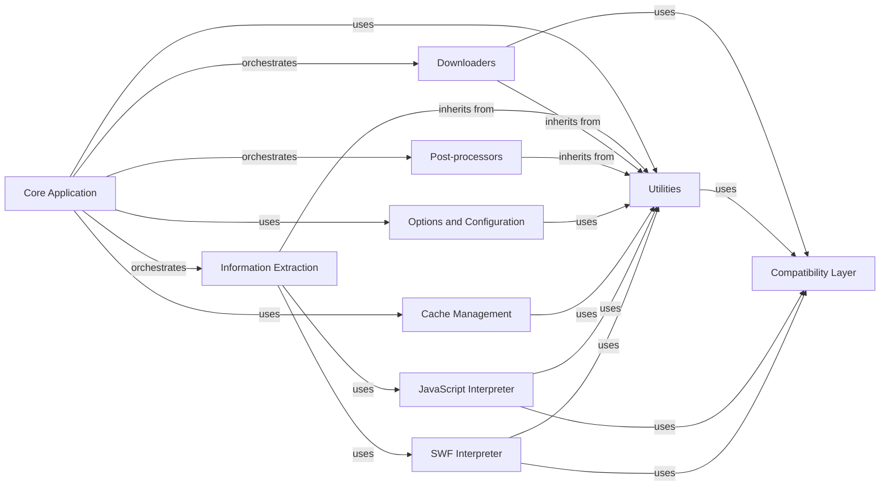

## Component Details

This graph illustrates the architecture of the youtube-dl project, focusing on its core functionalities. The `Core Application` acts as the central orchestrator, managing the video download lifecycle. It interacts with `Information Extraction` to gather video metadata and available formats from various websites, `Downloaders` to handle the actual file retrieval, and `Post-processors` for any subsequent media manipulation. Supporting these main components are `Utilities` for common helper functions, `Compatibility Layer` for cross-version compatibility, `Options and Configuration` for user input, `Cache Management` for performance, and specialized interpreters like `JavaScript Interpreter` and `SWF Interpreter` used by the `Information Extraction` component to handle dynamic content.

### Core Application
The central component of youtube-dl, responsible for orchestrating the entire video download process. It initializes the download options, registers information extractors, manages the download queue, and invokes appropriate downloaders and post-processors.

**Related Classes/Methods**:

- <a href="https://github.com/ytdl-org/youtube-dl/blob/master/youtube_dl/YoutubeDL.py#L148-L2722" target="_blank" rel="noopener noreferrer">`youtube_dl.YoutubeDL` (148:2722)</a>

### Information Extraction
Responsible for extracting video metadata and available formats from various websites. It includes a common base (`youtube_dl.extractor.common.InfoExtractor`) for general web parsing and numerous site-specific implementations (e.g., `youtube_dl.extractor.youtube.YoutubeIE`, `youtube_dl.extractor.facebook.FacebookIE`, `youtube_dl.extractor.dailymotion.DailymotionIE`) to handle the unique structures of different video platforms. It leverages common utilities for web requests, regex searching, and JSON parsing.

**Related Classes/Methods**:

- <a href="https://github.com/ytdl-org/youtube-dl/blob/master/youtube_dl/extractor/common.py#L98-L3361" target="_blank" rel="noopener noreferrer">`youtube_dl.extractor.common.InfoExtractor` (98:3361)</a>
- <a href="https://github.com/ytdl-org/youtube-dl/blob/master/youtube_dl/extractor/common.py#L619-L621" target="_blank" rel="noopener noreferrer">`youtube_dl.extractor.common.InfoExtractor:_real_extract` (619:621)</a>
- <a href="https://github.com/ytdl-org/youtube-dl/blob/master/youtube_dl/extractor/youtube.py#L2161-L2928" target="_blank" rel="noopener noreferrer">`youtube_dl.extractor.youtube.YoutubeIE:_real_extract` (2161:2928)</a>
- <a href="https://github.com/ytdl-org/youtube-dl/blob/master/youtube_dl/extractor/common.py#L803-L859" target="_blank" rel="noopener noreferrer">`youtube_dl.extractor.common.InfoExtractor:_download_webpage` (803:859)</a>
- <a href="https://github.com/ytdl-org/youtube-dl/blob/master/youtube_dl/extractor/common.py#L949-L959" target="_blank" rel="noopener noreferrer">`youtube_dl.extractor.common.InfoExtractor:_parse_json` (949:959)</a>
- <a href="https://github.com/ytdl-org/youtube-dl/blob/master/youtube_dl/extractor/common.py#L1062-L1096" target="_blank" rel="noopener noreferrer">`youtube_dl.extractor.common.InfoExtractor:_search_regex` (1062:1096)</a>
- <a href="https://github.com/ytdl-org/youtube-dl/blob/master/youtube_dl/extractor/common.py#L469-L477" target="_blank" rel="noopener noreferrer">`youtube_dl.extractor.common.InfoExtractor:initialize` (469:477)</a>
- <a href="https://github.com/ytdl-org/youtube-dl/blob/master/youtube_dl/extractor/common.py#L567-L586" target="_blank" rel="noopener noreferrer">`youtube_dl.extractor.common.InfoExtractor:extract` (567:586)</a>
- <a href="https://github.com/ytdl-org/youtube-dl/blob/master/youtube_dl/extractor/common.py#L1548-L1622" target="_blank" rel="noopener noreferrer">`youtube_dl.extractor.common.InfoExtractor:_sort_formats` (1548:1622)</a>
- <a href="https://github.com/ytdl-org/youtube-dl/blob/master/youtube_dl/extractor/facebook.py#L676-L680" target="_blank" rel="noopener noreferrer">`youtube_dl.extractor.facebook.FacebookIE:_real_extract` (676:680)</a>
- <a href="https://github.com/ytdl-org/youtube-dl/blob/master/youtube_dl/extractor/vimeo.py#L635-L796" target="_blank" rel="noopener noreferrer">`youtube_dl.extractor.vimeo.VimeoIE:_real_extract` (635:796)</a>
- <a href="https://github.com/ytdl-org/youtube-dl/blob/master/youtube_dl/extractor/twitch.py#L764-L848" target="_blank" rel="noopener noreferrer">`youtube_dl.extractor.twitch.TwitchStreamIE:_real_extract` (764:848)</a>
- <a href="https://github.com/ytdl-org/youtube-dl/blob/master/youtube_dl/extractor/dailymotion.py#L206-L322" target="_blank" rel="noopener noreferrer">`youtube_dl.extractor.dailymotion.DailymotionIE:_real_extract` (206:322)</a>

### Downloaders
A set of modules dedicated to handling the actual downloading of video and audio files. Different downloaders are implemented to support various protocols and streaming formats (e.g., HTTP, HLS, DASH, RTMP). They manage the download progress and file writing.

**Related Classes/Methods**:

- `youtube_dl.downloader` (full file reference)
- `youtube_dl.downloader.common` (full file reference)
- `youtube_dl.downloader.http` (full file reference)
- `youtube_dl.downloader.fragment` (full file reference)
- `youtube_dl.downloader.hls` (full file reference)
- `youtube_dl.downloader.dash` (full file reference)
- `youtube_dl.downloader.rtmp` (full file reference)

### Post-processors
Modules that perform additional operations on the downloaded media files. These tasks can include embedding thumbnails, converting formats, adding metadata, or executing external commands after the download is complete.

**Related Classes/Methods**:

- `youtube_dl.postprocessor` (full file reference)
- `youtube_dl.postprocessor.common` (full file reference)
- `youtube_dl.postprocessor.ffmpeg` (full file reference)
- `youtube_dl.postprocessor.embedthumbnail` (full file reference)
- `youtube_dl.postprocessor.metadatafromtitle` (full file reference)

### Utilities
A collection of helper functions and classes used across different parts of the youtube-dl application. This includes functionalities for network operations, file system interactions, string manipulation, and error handling.

**Related Classes/Methods**:

- `youtube_dl.utils` (full file reference)

### Compatibility Layer
This component provides functions and definitions to ensure compatibility across different Python versions and environments, abstracting away differences in standard library modules or built-in functions.

**Related Classes/Methods**:

- `youtube_dl.compat` (full file reference)

### Options and Configuration
Handles the parsing of command-line arguments and configuration options provided by the user. It defines the available options and their default values, influencing the behavior of other components like downloaders and post-processors.

**Related Classes/Methods**:

- `youtube_dl.options` (full file reference)

### Cache Management
Manages the caching of data to improve performance and reduce redundant network requests. This includes storing and retrieving cached information related to video URLs or extractor results.

**Related Classes/Methods**:

- `youtube_dl.cache` (full file reference)

### JavaScript Interpreter
A component responsible for interpreting JavaScript code often found on video hosting websites. This is crucial for extracting dynamic video URLs or deciphering obfuscated stream information.

**Related Classes/Methods**:

- `youtube_dl.jsinterp` (full file reference)

### SWF Interpreter
A component that can interpret ActionScript bytecode within SWF (Small Web Format) files. This is used to extract video information from older Flash-based video players.

**Related Classes/Methods**:

- `youtube_dl.swfinterp` (full file reference)

### [FAQ](https://github.com/CodeBoarding/GeneratedOnBoardings/tree/main?tab=readme-ov-file#faq)