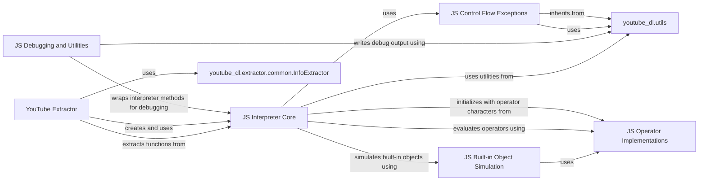

## Component Details

This graph illustrates the architecture of the JavaScript Interpreter subsystem within youtube-dl. The `JS Interpreter Core` is the central component responsible for executing JavaScript code, relying on `JS Operator Implementations` for arithmetic and logical operations, `JS Built-in Object Simulation` for emulating native JS objects, and `JS Control Flow Exceptions` for handling control flow. `JS Debugging and Utilities` aids in the development and monitoring of the interpreter. The `YouTube Extractor` is a primary consumer of the `JS Interpreter Core`, using it to de-obfuscate video URLs and extract dynamic information from YouTube pages. Both the interpreter and the extractor leverage general utilities provided by `youtube_dl.utils` and the base extractor functionalities from `youtube_dl.extractor.common.InfoExtractor`.

### JS Interpreter Core
This component is the central part of the JavaScript interpreter, responsible for parsing, interpreting, and executing JavaScript statements and expressions. It manages the execution flow, variable scopes, and handles various JavaScript constructs like assignments, function calls, control flow statements (if, for, while, switch), and object/array manipulations.

**Related Classes/Methods**:

- <a href="https://github.com/ytdl-org/youtube-dl/blob/master/youtube_dl/jsinterp.py#L402-L1515" target="_blank" rel="noopener noreferrer">`youtube_dl.jsinterp.JSInterpreter` (402:1515)</a>
- <a href="https://github.com/ytdl-org/youtube-dl/blob/master/youtube_dl/jsinterp.py#L341-L359" target="_blank" rel="noopener noreferrer">`youtube_dl.jsinterp.LocalNameSpace` (341:359)</a>
- <a href="https://github.com/ytdl-org/youtube-dl/blob/master/youtube_dl/jsinterp.py#L41-L52" target="_blank" rel="noopener noreferrer">`youtube_dl.jsinterp.function_with_repr` (41:52)</a>
- <a href="https://github.com/ytdl-org/youtube-dl/blob/master/youtube_dl/jsinterp.py#L832-L1398" target="_blank" rel="noopener noreferrer">`youtube_dl.jsinterp.JSInterpreter:interpret_statement` (832:1398)</a>
- <a href="https://github.com/ytdl-org/youtube-dl/blob/master/youtube_dl/jsinterp.py#L1464-L1468" target="_blank" rel="noopener noreferrer">`youtube_dl.jsinterp.JSInterpreter:extract_function` (1464:1468)</a>
- <a href="https://github.com/ytdl-org/youtube-dl/blob/master/youtube_dl/jsinterp.py#L423-L431" target="_blank" rel="noopener noreferrer">`youtube_dl.jsinterp.JSInterpreter.JS_Object` (423:431)</a>

### JS Operator Implementations
This component provides the Python implementations for various JavaScript operators, including arithmetic, bitwise, comparison, and unary operations. It also handles type conversions and nullish coalescing.

**Related Classes/Methods**:

- <a href="https://github.com/ytdl-org/youtube-dl/blob/master/youtube_dl/jsinterp.py#L56-L64" target="_blank" rel="noopener noreferrer">`youtube_dl.jsinterp.wraps_op` (56:64)</a>
- <a href="https://github.com/ytdl-org/youtube-dl/blob/master/youtube_dl/jsinterp.py#L79-L101" target="_blank" rel="noopener noreferrer">`youtube_dl.jsinterp._js_bit_op` (79:101)</a>
- <a href="https://github.com/ytdl-org/youtube-dl/blob/master/youtube_dl/jsinterp.py#L104-L121" target="_blank" rel="noopener noreferrer">`youtube_dl.jsinterp._js_arith_op` (104:121)</a>
- <a href="https://github.com/ytdl-org/youtube-dl/blob/master/youtube_dl/jsinterp.py#L127-L134" target="_blank" rel="noopener noreferrer">`youtube_dl.jsinterp._js_add` (127:134)</a>
- <a href="https://github.com/ytdl-org/youtube-dl/blob/master/youtube_dl/jsinterp.py#L141-L144" target="_blank" rel="noopener noreferrer">`youtube_dl.jsinterp._js_exp` (141:144)</a>
- <a href="https://github.com/ytdl-org/youtube-dl/blob/master/youtube_dl/jsinterp.py#L158-L167" target="_blank" rel="noopener noreferrer">`youtube_dl.jsinterp._js_toString` (158:167)</a>
- <a href="https://github.com/ytdl-org/youtube-dl/blob/master/youtube_dl/jsinterp.py#L147-L154" target="_blank" rel="noopener noreferrer">`youtube_dl.jsinterp._js_to_primitive` (147:154)</a>
- <a href="https://github.com/ytdl-org/youtube-dl/blob/master/youtube_dl/jsinterp.py#L173-L194" target="_blank" rel="noopener noreferrer">`youtube_dl.jsinterp._js_eq` (173:194)</a>
- <a href="https://github.com/ytdl-org/youtube-dl/blob/master/youtube_dl/jsinterp.py#L197-L198" target="_blank" rel="noopener noreferrer">`youtube_dl.jsinterp._js_neq` (197:198)</a>
- <a href="https://github.com/ytdl-org/youtube-dl/blob/master/youtube_dl/jsinterp.py#L201-L215" target="_blank" rel="noopener noreferrer">`youtube_dl.jsinterp._js_id_op` (201:215)</a>
- <a href="https://github.com/ytdl-org/youtube-dl/blob/master/youtube_dl/jsinterp.py#L218-L230" target="_blank" rel="noopener noreferrer">`youtube_dl.jsinterp._js_comp_op` (218:230)</a>
- <a href="https://github.com/ytdl-org/youtube-dl/blob/master/youtube_dl/jsinterp.py#L240-L246" target="_blank" rel="noopener noreferrer">`youtube_dl.jsinterp._js_unary_op` (240:246)</a>
- <a href="https://github.com/ytdl-org/youtube-dl/blob/master/youtube_dl/jsinterp.py#L233-L237" target="_blank" rel="noopener noreferrer">`youtube_dl.jsinterp._js_ternary` (233:237)</a>

### JS Control Flow Exceptions
This component defines custom exception classes that simulate JavaScript's control flow mechanisms like `break`, `continue`, and `throw`. These exceptions are caught by the `JS Interpreter Core` to alter the execution flow.

**Related Classes/Methods**:

- <a href="https://github.com/ytdl-org/youtube-dl/blob/master/youtube_dl/jsinterp.py#L325-L327" target="_blank" rel="noopener noreferrer">`youtube_dl.jsinterp.JS_Break` (325:327)</a>
- <a href="https://github.com/ytdl-org/youtube-dl/blob/master/youtube_dl/jsinterp.py#L330-L332" target="_blank" rel="noopener noreferrer">`youtube_dl.jsinterp.JS_Continue` (330:332)</a>
- <a href="https://github.com/ytdl-org/youtube-dl/blob/master/youtube_dl/jsinterp.py#L335-L338" target="_blank" rel="noopener noreferrer">`youtube_dl.jsinterp.JS_Throw` (335:338)</a>

### JS Built-in Object Simulation
This component provides Python classes that simulate the behavior of common JavaScript built-in objects like `RegExp` and `Date`, allowing the interpreter to handle operations involving these objects.

**Related Classes/Methods**:

- <a href="https://github.com/ytdl-org/youtube-dl/blob/master/youtube_dl/jsinterp.py#L433-L535" target="_blank" rel="noopener noreferrer">`youtube_dl.jsinterp.JSInterpreter.JS_RegExp` (433:535)</a>
- <a href="https://github.com/ytdl-org/youtube-dl/blob/master/youtube_dl/jsinterp.py#L537-L605" target="_blank" rel="noopener noreferrer">`youtube_dl.jsinterp.JSInterpreter.JS_Date` (537:605)</a>

### JS Debugging and Utilities
This component includes utilities for debugging the JavaScript interpretation process, such as logging statements, and other general utility functions used across the `jsinterp` module.

**Related Classes/Methods**:

- <a href="https://github.com/ytdl-org/youtube-dl/blob/master/youtube_dl/jsinterp.py#L362-L399" target="_blank" rel="noopener noreferrer">`youtube_dl.jsinterp.Debugger` (362:399)</a>
- <a href="https://github.com/ytdl-org/youtube-dl/blob/master/youtube_dl/jsinterp.py#L75-L76" target="_blank" rel="noopener noreferrer">`youtube_dl.jsinterp.JS_Undefined` (75:76)</a>
- `youtube_dl.jsinterp._NaN` (full file reference)
- `youtube_dl.jsinterp._Infinity` (full file reference)

### YouTube Extractor
This component represents the YouTube information extractor, which utilizes the `JS Interpreter Core` to parse and interpret JavaScript code found in YouTube's player files, primarily for extracting video signatures and other dynamic data.

**Related Classes/Methods**:

- <a href="https://github.com/ytdl-org/youtube-dl/blob/master/youtube_dl/extractor/youtube.py#L595-L2928" target="_blank" rel="noopener noreferrer">`youtube_dl.extractor.youtube.YoutubeIE` (595:2928)</a>
- <a href="https://github.com/ytdl-org/youtube-dl/blob/master/youtube_dl/extractor/youtube.py#L1789-L1819" target="_blank" rel="noopener noreferrer">`youtube_dl.extractor.youtube.YoutubeIE._parse_sig_js` (1789:1819)</a>
- <a href="https://github.com/ytdl-org/youtube-dl/blob/master/youtube_dl/extractor/youtube.py#L1959-L1968" target="_blank" rel="noopener noreferrer">`youtube_dl.extractor.youtube.YoutubeIE._extract_n_function_code` (1959:1968)</a>
- <a href="https://github.com/ytdl-org/youtube-dl/blob/master/youtube_dl/extractor/youtube.py#L1970-L1976" target="_blank" rel="noopener noreferrer">`youtube_dl.extractor.youtube.YoutubeIE._extract_n_function_code_jsi` (1970:1976)</a>
- <a href="https://github.com/ytdl-org/youtube-dl/blob/master/youtube_dl/extractor/youtube.py#L1978-L1993" target="_blank" rel="noopener noreferrer">`youtube_dl.extractor.youtube.YoutubeIE._extract_n_function_from_code` (1978:1993)</a>

### youtube_dl.utils
This component provides various utility functions used across the youtube-dl project, including error handling and string manipulation.

**Related Classes/Methods**:

- <a href="https://github.com/ytdl-org/youtube-dl/blob/master/youtube_dl/utils.py#L2387-L2413" target="_blank" rel="noopener noreferrer">`youtube_dl.utils.ExtractorError` (2387:2413)</a>
- <a href="https://github.com/ytdl-org/youtube-dl/blob/master/youtube_dl/utils.py#L4654-L4655" target="_blank" rel="noopener noreferrer">`youtube_dl.utils.error_to_compat_str` (4654:4655)</a>
- <a href="https://github.com/ytdl-org/youtube-dl/blob/master/youtube_dl/utils.py#L3404-L3423" target="_blank" rel="noopener noreferrer">`youtube_dl.utils.write_string` (3404:3423)</a>

### youtube_dl.extractor.common.InfoExtractor
This component is the base class for all information extractors in youtube-dl, providing common functionalities for extracting video information.

**Related Classes/Methods**:

- <a href="https://github.com/ytdl-org/youtube-dl/blob/master/youtube_dl/extractor/common.py#L98-L3361" target="_blank" rel="noopener noreferrer">`youtube_dl.extractor.common.InfoExtractor` (98:3361)</a>

### [FAQ](https://github.com/CodeBoarding/GeneratedOnBoardings/tree/main?tab=readme-ov-file#faq)