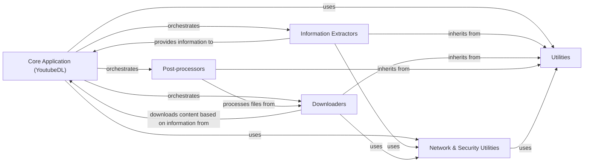

## Component Details

This graph illustrates the architecture of the youtube-dl application, focusing on its core components and their interactions. The Core Application orchestrates the entire video download process, leveraging Information Extractors to gather video metadata, Downloaders to handle content acquisition, and Post-processors for file manipulation. Various Utilities provide common functionalities, while Network & Security Utilities specifically manage secure network communications and proxy connections, serving both the Core Application and other components like Extractors and Downloaders.

### Core Application (YoutubeDL)
The central component of youtube-dl, responsible for orchestrating the video download process. It initializes extractors, manages download options, handles post-processing, and interacts with various utility functions.

**Related Classes/Methods**:

- <a href="https://github.com/ytdl-org/youtube-dl/blob/master/youtube_dl/YoutubeDL.py#L148-L2722" target="_blank" rel="noopener noreferrer">`youtube_dl.YoutubeDL` (148:2722)</a>

### Information Extractors
A vast collection of modules responsible for extracting video information (metadata, stream URLs) from various websites. Each extractor is designed for a specific site or a group of similar sites, inheriting common functionalities from `youtube_dl.extractor.common.InfoExtractor`.

**Related Classes/Methods**:

- `youtube_dl.extractor` (full file reference)
- <a href="https://github.com/ytdl-org/youtube-dl/blob/master/youtube_dl/extractor/common.py#L98-L3361" target="_blank" rel="noopener noreferrer">`youtube_dl.extractor.common.InfoExtractor` (98:3361)</a>
- `youtube_dl.extractor.extractors` (full file reference)

### Downloaders
Modules responsible for handling the actual downloading of video and audio streams. This includes common HTTP downloads, as well as specialized downloaders for various streaming protocols like DASH, HLS, F4M, and RTMP. They often inherit from `youtube_dl.downloader.common.FileDownloader`.

**Related Classes/Methods**:

- `youtube_dl.downloader` (full file reference)
- <a href="https://github.com/ytdl-org/youtube-dl/blob/master/youtube_dl/downloader/common.py#L20-L405" target="_blank" rel="noopener noreferrer">`youtube_dl.downloader.common.FileDownloader` (20:405)</a>
- `youtube_dl.downloader.dash` (full file reference)
- `youtube_dl.downloader.hls` (full file reference)
- `youtube_dl.downloader.rtmp` (full file reference)

### Post-processors
Components that perform operations on the downloaded files, such as embedding thumbnails, converting formats, or adding metadata. These modules typically extend `youtube_dl.postprocessor.common.PostProcessor`.

**Related Classes/Methods**:

- `youtube_dl.postprocessor` (full file reference)
- <a href="https://github.com/ytdl-org/youtube-dl/blob/master/youtube_dl/postprocessor/common.py#L12-L65" target="_blank" rel="noopener noreferrer">`youtube_dl.postprocessor.common.PostProcessor` (12:65)</a>
- `youtube_dl.postprocessor.ffmpeg` (full file reference)
- `youtube_dl.postprocessor.embedthumbnail` (full file reference)

### Utilities
A collection of helper functions and classes used across different parts of the youtube-dl application, including network operations, file system interactions, and data manipulation.

**Related Classes/Methods**:

- `youtube_dl.utils` (full file reference)
- `youtube_dl.compat` (full file reference)
- `youtube_dl.options` (full file reference)
- `youtube_dl.cache` (full file reference)
- `youtube_dl.version` (full file reference)

### Network & Security Utilities
This component is responsible for handling secure network communications within youtube-dl. It provides core functionalities for AES decryption of encrypted data streams and managing SOCKS proxy connections to facilitate network requests through proxies.

**Related Classes/Methods**:

- <a href="https://github.com/ytdl-org/youtube-dl/blob/master/youtube_dl/aes.py#L23-L46" target="_blank" rel="noopener noreferrer">`youtube_dl.aes:aes_ctr_decrypt` (23:46)</a>
- <a href="https://github.com/ytdl-org/youtube-dl/blob/master/youtube_dl/socks.py#L269-L270" target="_blank" rel="noopener noreferrer">`youtube_dl.socks.sockssocket:connect` (269:270)</a>
- <a href="https://github.com/ytdl-org/youtube-dl/blob/master/youtube_dl/aes.py#L49-L72" target="_blank" rel="noopener noreferrer">`youtube_dl.aes:aes_cbc_decrypt` (49:72)</a>
- <a href="https://github.com/ytdl-org/youtube-dl/blob/master/youtube_dl/aes.py#L201-L236" target="_blank" rel="noopener noreferrer">`youtube_dl.aes:aes_decrypt_text` (201:236)</a>
- <a href="https://github.com/ytdl-org/youtube-dl/blob/master/youtube_dl/socks.py#L116-L119" target="_blank" rel="noopener noreferrer">`youtube_dl.socks.sockssocket:setproxy` (116:119)</a>
- <a href="https://github.com/ytdl-org/youtube-dl/blob/master/youtube_dl/socks.py#L111-L273" target="_blank" rel="noopener noreferrer">`youtube_dl.socks.sockssocket` (111:273)</a>
- `youtube_dl.aes` (full file reference)
- `youtube_dl.socks` (full file reference)

### [FAQ](https://github.com/CodeBoarding/GeneratedOnBoardings/tree/main?tab=readme-ov-file#faq)