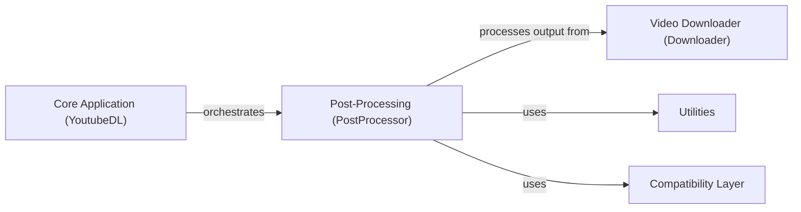

## Component Details

This graph illustrates the Post-Processing component within youtube-dl, detailing its structure, purpose, and interactions with other core components. The Post-Processing component is responsible for various operations on downloaded media files, such as audio extraction, video format conversion, embedding subtitles, and adding metadata, often leveraging external tools like FFmpeg. It receives processed files from the Video Downloader and is orchestrated by the Core Application, utilizing common utilities and compatibility layers.

### Post-Processing (PostProcessor)
Handles various operations on downloaded media files after the download is complete. This includes audio extraction, video format conversion, embedding subtitles, adding metadata, and executing external commands. It leverages external tools like FFmpeg for many of these tasks.

**Related Classes/Methods**:

- `youtube_dl.postprocessor` (full file reference)
- <a href="https://github.com/ytdl-org/youtube-dl/blob/master/youtube_dl/postprocessor/common.py#L12-L65" target="_blank" rel="noopener noreferrer">`youtube_dl.postprocessor.common.PostProcessor` (12:65)</a>
- <a href="https://github.com/ytdl-org/youtube-dl/blob/master/youtube_dl/postprocessor/ffmpeg.py#L55-L242" target="_blank" rel="noopener noreferrer">`youtube_dl.postprocessor.ffmpeg.FFmpegPostProcessor` (55:242)</a>
- <a href="https://github.com/ytdl-org/youtube-dl/blob/master/youtube_dl/postprocessor/ffmpeg.py#L245-L345" target="_blank" rel="noopener noreferrer">`youtube_dl.postprocessor.ffmpeg.FFmpegExtractAudioPP` (245:345)</a>
- <a href="https://github.com/ytdl-org/youtube-dl/blob/master/youtube_dl/postprocessor/ffmpeg.py#L348-L368" target="_blank" rel="noopener noreferrer">`youtube_dl.postprocessor.ffmpeg.FFmpegVideoConvertorPP` (348:368)</a>
- <a href="https://github.com/ytdl-org/youtube-dl/blob/master/youtube_dl/postprocessor/ffmpeg.py#L371-L426" target="_blank" rel="noopener noreferrer">`youtube_dl.postprocessor.ffmpeg.FFmpegEmbedSubtitlePP` (371:426)</a>
- <a href="https://github.com/ytdl-org/youtube-dl/blob/master/youtube_dl/postprocessor/ffmpeg.py#L429-L510" target="_blank" rel="noopener noreferrer">`youtube_dl.postprocessor.ffmpeg.FFmpegMetadataPP` (429:510)</a>
- <a href="https://github.com/ytdl-org/youtube-dl/blob/master/youtube_dl/postprocessor/ffmpeg.py#L513-L538" target="_blank" rel="noopener noreferrer">`youtube_dl.postprocessor.ffmpeg.FFmpegMergerPP` (513:538)</a>
- <a href="https://github.com/ytdl-org/youtube-dl/blob/master/youtube_dl/postprocessor/embedthumbnail.py#L28-L133" target="_blank" rel="noopener noreferrer">`youtube_dl.postprocessor.embedthumbnail.EmbedThumbnailPP` (28:133)</a>
- <a href="https://github.com/ytdl-org/youtube-dl/blob/master/youtube_dl/postprocessor/execafterdownload.py#L13-L31" target="_blank" rel="noopener noreferrer">`youtube_dl.postprocessor.execafterdownload.ExecAfterDownloadPP` (13:31)</a>
- <a href="https://github.com/ytdl-org/youtube-dl/blob/master/youtube_dl/postprocessor/metadatafromtitle.py#L8-L50" target="_blank" rel="noopener noreferrer">`youtube_dl.postprocessor.metadatafromtitle.MetadataFromTitlePP` (8:50)</a>
- <a href="https://github.com/ytdl-org/youtube-dl/blob/master/youtube_dl/postprocessor/xattrpp.py#L13-L79" target="_blank" rel="noopener noreferrer">`youtube_dl.postprocessor.xattrpp.XAttrMetadataPP` (13:79)</a>
- <a href="https://github.com/ytdl-org/youtube-dl/blob/master/youtube_dl/postprocessor/common.py#L41-L56" target="_blank" rel="noopener noreferrer">`youtube_dl.postprocessor.common.PostProcessor:run` (41:56)</a>
- <a href="https://github.com/ytdl-org/youtube-dl/blob/master/youtube_dl/postprocessor/ffmpeg.py#L265-L345" target="_blank" rel="noopener noreferrer">`youtube_dl.postprocessor.ffmpeg.FFmpegExtractAudioPP:run` (265:345)</a>
- <a href="https://github.com/ytdl-org/youtube-dl/blob/master/youtube_dl/postprocessor/ffmpeg.py#L234-L235" target="_blank" rel="noopener noreferrer">`youtube_dl.postprocessor.ffmpeg.FFmpegPostProcessor:run_ffmpeg` (234:235)</a>
- <a href="https://github.com/ytdl-org/youtube-dl/blob/master/youtube_dl/postprocessor/ffmpeg.py#L514-L521" target="_blank" rel="noopener noreferrer">`youtube_dl.postprocessor.ffmpeg.FFmpegMergerPP:run` (514:521)</a>
- <a href="https://github.com/ytdl-org/youtube-dl/blob/master/youtube_dl/postprocessor/common.py#L58-L62" target="_blank" rel="noopener noreferrer">`youtube_dl.postprocessor.common.PostProcessor:try_utime` (58:62)</a>
- <a href="https://github.com/ytdl-org/youtube-dl/blob/master/youtube_dl/postprocessor/common.py#L64-L65" target="_blank" rel="noopener noreferrer">`youtube_dl.postprocessor.common.PostProcessor:_configuration_args` (64:65)</a>

### Core Application (YoutubeDL)
The central component of youtube-dl, responsible for orchestrating the entire video download process. It initializes the downloader, extractor, and post-processor components, handles options, and manages the overall workflow from URL parsing to file saving.

**Related Classes/Methods**:

- <a href="https://github.com/ytdl-org/youtube-dl/blob/master/youtube_dl/YoutubeDL.py#L148-L2722" target="_blank" rel="noopener noreferrer">`youtube_dl.YoutubeDL` (148:2722)</a>

### Video Downloader (Downloader)
Manages the actual downloading of video and audio streams. It supports various protocols and external downloaders, handling progress reporting, retries, and file writing. Different downloaders are implemented for different streaming technologies (e.g., HTTP, HLS, DASH, RTMP).

**Related Classes/Methods**:

- `youtube_dl.downloader` (full file reference)
- `youtube_dl.downloader.common` (full file reference)

### Utilities
Provides a collection of helper functions and classes used across different parts of the youtube-dl application. This includes functions for network operations, string manipulation, file system interactions, and error handling.

**Related Classes/Methods**:

- `youtube_dl.utils` (full file reference)

### Compatibility Layer
Ensures compatibility across different Python versions and environments by providing polyfills and alternative implementations for functions or modules that behave differently or are missing in certain Python versions.

**Related Classes/Methods**:

- `youtube_dl.compat` (full file reference)

### [FAQ](https://github.com/CodeBoarding/GeneratedOnBoardings/tree/main?tab=readme-ov-file#faq)