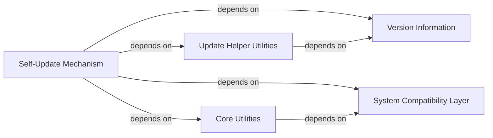

## Component Details

This graph illustrates the architecture of the self-update mechanism in youtube-dl. The core 'Self-Update Mechanism' component orchestrates the update process, relying on 'Update Helper Utilities' for cryptographic verification and release note handling, 'Core Utilities' for fundamental operations like string encoding and file system interactions, 'System Compatibility Layer' for cross-platform compatibility, and 'Version Information' to determine the current application version. The flow generally starts with the 'Self-Update Mechanism' checking for updates, then utilizing helper and utility components to download, verify, and install the new version.

### Self-Update Mechanism
The central component responsible for initiating, coordinating, and executing the self-update process. It checks for new versions, downloads update files, verifies their integrity using RSA signatures, and performs the file replacement.

**Related Classes/Methods**:

- <a href="https://github.com/ytdl-org/youtube-dl/blob/master/youtube_dl/update.py#L34-L176" target="_blank" rel="noopener noreferrer">`youtube_dl.update:update_self` (34:176)</a>

### Update Helper Utilities
A collection of functions that support the Self-Update Mechanism by handling specific tasks like RSA signature verification and managing release notes.

**Related Classes/Methods**:

- <a href="https://github.com/ytdl-org/youtube-dl/blob/master/youtube_dl/update.py#L20-L31" target="_blank" rel="noopener noreferrer">`youtube_dl.update:rsa_verify` (20:31)</a>
- <a href="https://github.com/ytdl-org/youtube-dl/blob/master/youtube_dl/update.py#L179-L184" target="_blank" rel="noopener noreferrer">`youtube_dl.update:get_notes` (179:184)</a>
- <a href="https://github.com/ytdl-org/youtube-dl/blob/master/youtube_dl/update.py#L187-L192" target="_blank" rel="noopener noreferrer">`youtube_dl.update:print_notes` (187:192)</a>

### Core Utilities
Provides a wide range of general-purpose utility functions used throughout the youtube-dl project, including string encoding/decoding, file system operations, and network-related helpers.

**Related Classes/Methods**:

- <a href="https://github.com/ytdl-org/youtube-dl/blob/master/youtube_dl/utils.py#L4434-L4436" target="_blank" rel="noopener noreferrer">`youtube_dl.utils:encode_compat_str` (4434:4436)</a>
- <a href="https://github.com/ytdl-org/youtube-dl/blob/master/youtube_dl/utils.py#L1794-L1806" target="_blank" rel="noopener noreferrer">`youtube_dl.utils:preferredencoding` (1794:1806)</a>

### System Compatibility Layer
A module designed to abstract away differences between Python 2 and Python 3, and various operating systems, ensuring that core functionalities work consistently across different environments.

**Related Classes/Methods**:

- `youtube_dl.compat:compat_realpath` (full file reference)
- `youtube_dl.compat:compat_open` (full file reference)

### Version Information
A simple module that holds the current version string of the youtube-dl application.

**Related Classes/Methods**:

- `youtube_dl.version` (full file reference)

### [FAQ](https://github.com/CodeBoarding/GeneratedOnBoardings/tree/main?tab=readme-ov-file#faq)