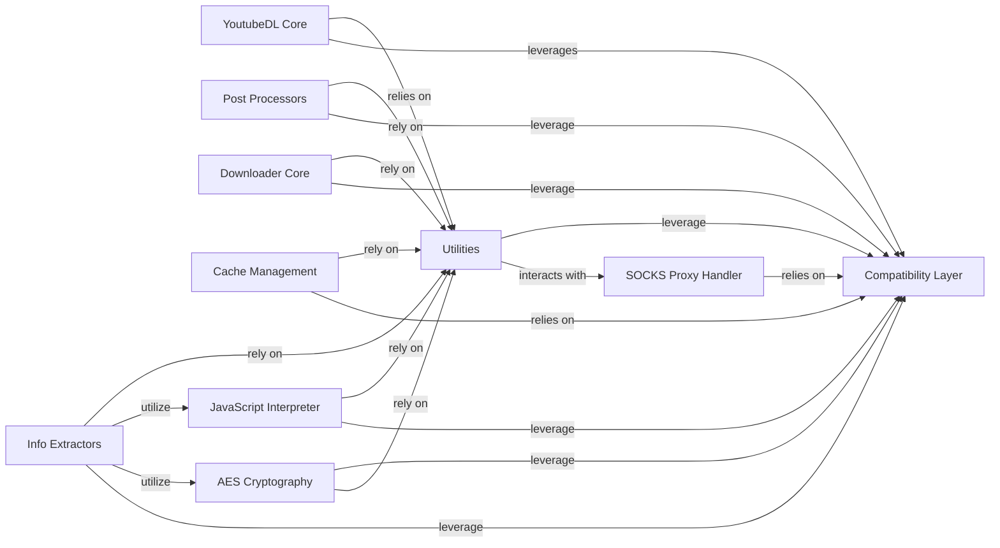

## Component Details

This graph provides an overview of the Utility Functions component within the youtube-dl project, detailing its structure, purpose, and interactions with other core components. It highlights how general-purpose helper functions and a compatibility layer are central to various operations, including download management, information extraction, and post-processing, ensuring cross-environment functionality and efficient data handling.

### Utilities
A comprehensive collection of general-purpose helper functions used across the entire youtube-dl project. These utilities cover tasks such as file system operations, string manipulation, network request handling, date/time parsing, and error formatting.

**Related Classes/Methods**:

- <a href="https://github.com/ytdl-org/youtube-dl/blob/master/youtube_dl/utils.py#L2085-L2127" target="_blank" rel="noopener noreferrer">`youtube_dl.utils:sanitize_filename` (2085:2127)</a>
- <a href="https://github.com/ytdl-org/youtube-dl/blob/master/youtube_dl/utils.py#L2387-L2413" target="_blank" rel="noopener noreferrer">`youtube_dl.utils:ExtractorError` (2387:2413)</a>
- <a href="https://github.com/ytdl-org/youtube-dl/blob/master/youtube_dl/utils.py#L3404-L3423" target="_blank" rel="noopener noreferrer">`youtube_dl.utils:write_string` (3404:3423)</a>
- <a href="https://github.com/ytdl-org/youtube-dl/blob/master/youtube_dl/utils.py#L3155-L3169" target="_blank" rel="noopener noreferrer">`youtube_dl.utils:parse_iso8601` (3155:3169)</a>
- <a href="https://github.com/ytdl-org/youtube-dl/blob/master/youtube_dl/utils.py#L3810-L3821" target="_blank" rel="noopener noreferrer">`youtube_dl.utils:urljoin` (3810:3821)</a>
- <a href="https://github.com/ytdl-org/youtube-dl/blob/master/youtube_dl/utils.py#L6249-L6535" target="_blank" rel="noopener noreferrer">`youtube_dl.utils:traverse_obj` (6249:6535)</a>
- <a href="https://github.com/ytdl-org/youtube-dl/blob/master/youtube_dl/utils.py#L2382-L2384" target="_blank" rel="noopener noreferrer">`youtube_dl.utils.YoutubeDLError` (2382:2384)</a>
- <a href="https://github.com/ytdl-org/youtube-dl/blob/master/youtube_dl/utils.py#L2489-L2503" target="_blank" rel="noopener noreferrer">`youtube_dl.utils.ContentTooShortError` (2489:2503)</a>
- <a href="https://github.com/ytdl-org/youtube-dl/blob/master/youtube_dl/utils.py#L2440-L2451" target="_blank" rel="noopener noreferrer">`youtube_dl.utils.DownloadError` (2440:2451)</a>
- <a href="https://github.com/ytdl-org/youtube-dl/blob/master/youtube_dl/utils.py#L2428-L2437" target="_blank" rel="noopener noreferrer">`youtube_dl.utils.GeoRestrictedError` (2428:2437)</a>
- <a href="https://github.com/ytdl-org/youtube-dl/blob/master/youtube_dl/utils.py#L4162-L4188" target="_blank" rel="noopener noreferrer">`youtube_dl.utils.InAdvancePagedList` (4162:4188)</a>
- <a href="https://github.com/ytdl-org/youtube-dl/blob/master/youtube_dl/utils.py#L2475-L2477" target="_blank" rel="noopener noreferrer">`youtube_dl.utils.MaxDownloadsReached` (2475:2477)</a>
- <a href="https://github.com/ytdl-org/youtube-dl/blob/master/youtube_dl/utils.py#L4110-L4159" target="_blank" rel="noopener noreferrer">`youtube_dl.utils.OnDemandPagedList` (4110:4159)</a>
- <a href="https://github.com/ytdl-org/youtube-dl/blob/master/youtube_dl/utils.py#L2463-L2472" target="_blank" rel="noopener noreferrer">`youtube_dl.utils.PostProcessingError` (2463:2472)</a>
- <a href="https://github.com/ytdl-org/youtube-dl/blob/master/youtube_dl/utils.py#L2423-L2425" target="_blank" rel="noopener noreferrer">`youtube_dl.utils.RegexNotFoundError` (2423:2425)</a>
- <a href="https://github.com/ytdl-org/youtube-dl/blob/master/youtube_dl/utils.py#L2454-L2460" target="_blank" rel="noopener noreferrer">`youtube_dl.utils.SameFileError` (2454:2460)</a>
- <a href="https://github.com/ytdl-org/youtube-dl/blob/master/youtube_dl/utils.py#L2480-L2486" target="_blank" rel="noopener noreferrer">`youtube_dl.utils.UnavailableVideoError` (2480:2486)</a>
- <a href="https://github.com/ytdl-org/youtube-dl/blob/master/youtube_dl/utils.py#L2416-L2420" target="_blank" rel="noopener noreferrer">`youtube_dl.utils.UnsupportedError` (2416:2420)</a>
- <a href="https://github.com/ytdl-org/youtube-dl/blob/master/youtube_dl/utils.py#L2506-L2519" target="_blank" rel="noopener noreferrer">`youtube_dl.utils.XAttrMetadataError` (2506:2519)</a>
- <a href="https://github.com/ytdl-org/youtube-dl/blob/master/youtube_dl/utils.py#L2522-L2523" target="_blank" rel="noopener noreferrer">`youtube_dl.utils.XAttrUnavailableError` (2522:2523)</a>
- <a href="https://github.com/ytdl-org/youtube-dl/blob/master/youtube_dl/utils.py#L2900-L3028" target="_blank" rel="noopener noreferrer">`youtube_dl.utils.YoutubeDLCookieJar` (2900:3028)</a>
- <a href="https://github.com/ytdl-org/youtube-dl/blob/master/youtube_dl/utils.py#L2832-L2872" target="_blank" rel="noopener noreferrer">`youtube_dl.utils.make_socks_conn_class` (2832:2872)</a>

### Compatibility Layer
Provides abstractions and polyfills to ensure the application runs smoothly across different Python 2 and Python 3 environments, handling differences in standard library modules and language features.

**Related Classes/Methods**:

- `youtube_dl.compat.compat_open` (full file reference)
- `youtube_dl.compat.compat_struct_unpack` (full file reference)
- `youtube_dl.compat.compat_b64decode` (full file reference)
- `youtube_dl.compat` (full file reference)

### YoutubeDL Core
The central orchestrator of the youtube-dl application, responsible for managing the download lifecycle, processing options, and coordinating with other components like Info Extractors, Post Processors, and Downloaders. It handles file naming, error reporting, and overall download flow.

**Related Classes/Methods**:

- <a href="https://github.com/ytdl-org/youtube-dl/blob/master/youtube_dl/YoutubeDL.py#L148-L2722" target="_blank" rel="noopener noreferrer">`youtube_dl.YoutubeDL` (148:2722)</a>

### Info Extractors
A set of specialized modules, each designed to extract video metadata (like title, description, available formats, and stream URLs) from specific video hosting websites. They are responsible for understanding the unique structure of each site.

**Related Classes/Methods**:

- `youtube_dl.extractor` (full file reference)

### Post Processors
Modules that perform operations on downloaded media files after the initial download is complete. These operations include merging separate audio and video streams, embedding thumbnails, converting file formats, and adding metadata.

**Related Classes/Methods**:

- `youtube_dl.postprocessor` (full file reference)

### Downloader Core
The base component responsible for handling the actual downloading of video and audio data from the internet. It manages the connection, progress reporting, and saving the file to disk.

**Related Classes/Methods**:

- `youtube_dl.downloader` (full file reference)

### Cache Management
Manages a local cache on the filesystem to store and retrieve frequently accessed data, such as extractor information or download archives, thereby improving performance and reducing redundant network requests.

**Related Classes/Methods**:

- <a href="https://github.com/ytdl-org/youtube-dl/blob/master/youtube_dl/cache.py#L27-L145" target="_blank" rel="noopener noreferrer">`youtube_dl.cache.Cache` (27:145)</a>

### JavaScript Interpreter
A component capable of parsing and executing JavaScript code found on webpages. This is primarily used by Info Extractors to decipher dynamic video URLs or signatures that are obfuscated within JavaScript.

**Related Classes/Methods**:

- `youtube_dl.jsinterp` (full file reference)

### AES Cryptography
Provides functionalities for Advanced Encryption Standard (AES) operations, which are used for decrypting certain video streams or data that are protected with AES encryption.

**Related Classes/Methods**:

- `youtube_dl.aes` (full file reference)

### SOCKS Proxy Handler
Implements support for SOCKS proxy protocols, enabling network requests to be routed through a proxy server. This is crucial for bypassing geo-restrictions or for privacy concerns.

**Related Classes/Methods**:

- `youtube_dl.socks` (full file reference)

### [FAQ](https://github.com/CodeBoarding/GeneratedOnBoardings/tree/main?tab=readme-ov-file#faq)