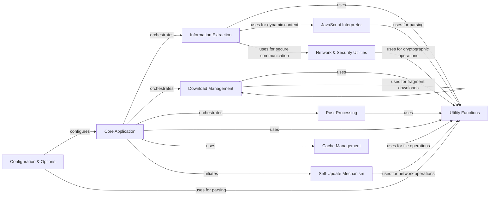

## Component Details

youtube-dl is a command-line program to download videos from YouTube.com and other video sites. The main flow involves parsing user options, extracting video information from a given URL using site-specific extractors, downloading the media file using appropriate downloaders, and finally, performing any requested post-processing operations. Its purpose is to provide a versatile and robust solution for downloading and managing online video content.

### Core Application
The central orchestrator of youtube-dl. It initializes the download process, loads configurations, manages information extractors, applies post-processors, and handles overall program flow, error reporting, and user interaction. It acts as the main entry point and coordinates all major operations.

**Related Classes/Methods**:

- `youtube_dl.youtube_dl.YoutubeDL:__init__` (158:210)
- `youtube_dl.youtube_dl.YoutubeDL:extract_info` (340:366)
- `youtube_dl.youtube_dl.YoutubeDL:download` (809:830)
- `youtube_dl.youtube_dl.YoutubeDL:process_ie_result` (401:468)
- `youtube_dl.youtube_dl.YoutubeDL:post_process` (860:878)

### Information Extraction
Responsible for extracting video metadata and available formats from various websites. It includes a common base for general web parsing and numerous site-specific implementations to handle the unique structures of different video platforms.

**Related Classes/Methods**:

- <a href="https://github.com/ytdl-org/youtube-dl/blob/master/youtube_dl/extractor/common.py#L619-L621" target="_blank" rel="noopener noreferrer">`youtube_dl.extractor.common.InfoExtractor:_real_extract` (619:621)</a>
- <a href="https://github.com/ytdl-org/youtube-dl/blob/master/youtube_dl/extractor/youtube.py#L2161-L2928" target="_blank" rel="noopener noreferrer">`youtube_dl.extractor.youtube.YoutubeIE:_real_extract` (2161:2928)</a>
- <a href="https://github.com/ytdl-org/youtube-dl/blob/master/youtube_dl/extractor/common.py#L803-L859" target="_blank" rel="noopener noreferrer">`youtube_dl.extractor.common.InfoExtractor:_download_webpage` (803:859)</a>
- <a href="https://github.com/ytdl-org/youtube-dl/blob/master/youtube_dl/extractor/common.py#L949-L959" target="_blank" rel="noopener noreferrer">`youtube_dl.extractor.common.InfoExtractor:_parse_json` (949:959)</a>
- <a href="https://github.com/ytdl-org/youtube-dl/blob/master/youtube_dl/extractor/common.py#L1062-L1096" target="_blank" rel="noopener noreferrer">`youtube_dl.extractor.common.InfoExtractor:_search_regex` (1062:1096)</a>
- <a href="https://github.com/ytdl-org/youtube-dl/blob/master/youtube_dl/extractor/common.py#L469-L477" target="_blank" rel="noopener noreferrer">`youtube-dl.youtube_dl.extractor.common.InfoExtractor:initialize` (469:477)</a>
- <a href="https://github.com/ytdl-org/youtube-dl/blob/master/youtube_dl/extractor/common.py#L567-L586" target="_blank" rel="noopener noreferrer">`youtube-dl.youtube_dl.extractor.common.InfoExtractor:extract` (567:586)</a>
- <a href="https://github.com/ytdl-org/youtube-dl/blob/master/youtube_dl/extractor/common.py#L1548-L1622" target="_blank" rel="noopener noreferrer">`youtube-dl.youtube_dl.extractor.common.InfoExtractor:_sort_formats` (1548:1622)</a>
- <a href="https://github.com/ytdl-org/youtube-dl/blob/master/youtube_dl/extractor/facebook.py#L676-L680" target="_blank" rel="noopener noreferrer">`youtube-dl.youtube_dl.extractor.facebook.FacebookIE:_real_extract` (676:680)</a>
- <a href="https://github.com/ytdl-org/youtube-dl/blob/master/youtube_dl/extractor/vimeo.py#L635-L796" target="_blank" rel="noopener noreferrer">`youtube-dl.youtube_dl.extractor.vimeo.VimeoIE:_real_extract` (635:796)</a>
- <a href="https://github.com/ytdl-org/youtube-dl/blob/master/youtube_dl/extractor/twitch.py#L764-L848" target="_blank" rel="noopener noreferrer">`youtube-dl.youtube_dl.extractor.twitch.TwitchStreamIE:_real_extract` (764:848)</a>
- <a href="https://github.com/ytdl-org/youtube-dl/blob/master/youtube_dl/extractor/dailymotion.py#L206-L322" target="_blank" rel="noopener noreferrer">`youtube-dl.youtube_dl.extractor.dailymotion.DailymotionIE:_real_extract` (206:322)</a>

### Download Management
Handles the actual downloading of video and audio files from URLs. This component supports various protocols (HTTP, HLS, DASH, F4M) and manages download progress, retries, and temporary files. It also integrates with external downloaders.

**Related Classes/Methods**:

- <a href="https://github.com/ytdl-org/youtube-dl/blob/master/youtube_dl/downloader/common.py#L382-L384" target="_blank" rel="noopener noreferrer">`youtube_dl.downloader.common.FileDownloader:real_download` (382:384)</a>
- <a href="https://github.com/ytdl-org/youtube-dl/blob/master/youtube_dl/downloader/http.py#L28-L362" target="_blank" rel="noopener noreferrer">`youtube_dl.downloader.http.HttpFD:real_download` (28:362)</a>
- <a href="https://github.com/ytdl-org/youtube-dl/blob/master/youtube_dl/downloader/fragment.py#L98-L120" target="_blank" rel="noopener noreferrer">`youtube_dl.downloader.fragment.FragmentFD:_download_fragment` (98:120)</a>
- <a href="https://github.com/ytdl-org/youtube-dl/blob/master/youtube_dl/downloader/fragment.py#L122-L131" target="_blank" rel="noopener noreferrer">`youtube_dl.downloader.fragment.FragmentFD:_append_fragment` (122:131)</a>
- <a href="https://github.com/ytdl-org/youtube-dl/blob/master/youtube_dl/downloader/common.py#L258-L316" target="_blank" rel="noopener noreferrer">`youtube-dl.youtube_dl.downloader.common.FileDownloader:report_progress` (258:316)</a>
- <a href="https://github.com/ytdl-org/youtube-dl/blob/master/youtube_dl/downloader/common.py#L193-L198" target="_blank" rel="noopener noreferrer">`youtube-dl.youtube_dl.downloader.common.FileDownloader:temp_name` (193:198)</a>
- <a href="https://github.com/ytdl-org/youtube-dl/blob/master/youtube_dl/downloader/common.py#L208-L214" target="_blank" rel="noopener noreferrer">`youtube-dl.youtube_dl.downloader.common.FileDownloader:try_rename` (208:214)</a>
- <a href="https://github.com/ytdl-org/youtube-dl/blob/master/youtube_dl/downloader/fragment.py#L68-L70" target="_blank" rel="noopener noreferrer">`youtube-dl.youtube_dl.downloader.fragment.FragmentFD:_prepare_and_start_frag_download` (68:70)</a>
- <a href="https://github.com/ytdl-org/youtube-dl/blob/master/youtube_dl/downloader/hls.py#L60-L216" target="_blank" rel="noopener noreferrer">`youtube-dl.youtube_dl.downloader.hls.HlsFD:real_download` (60:216)</a>
- <a href="https://github.com/ytdl-org/youtube-dl/blob/master/youtube_dl/downloader/dash.py#L20-L83" target="_blank" rel="noopener noreferrer">`youtube-dl.youtube_dl.downloader.dash.DashSegmentsFD:real_download` (20:83)</a>
- <a href="https://github.com/ytdl-org/youtube-dl/blob/master/youtube_dl/downloader/f4m.py#L319-L438" target="_blank" rel="noopener noreferrer">`youtube-dl.youtube_dl.downloader.f4m.F4mFD:real_download` (319:438)</a>
- <a href="https://github.com/ytdl-org/youtube-dl/blob/master/youtube_dl/downloader/f4m.py#L178-L181" target="_blank" rel="noopener noreferrer">`youtube-dl.youtube_dl.downloader.f4m.FlvReader:read_bootstrap_info` (178:181)</a>
- <a href="https://github.com/ytdl-org/youtube-dl/blob/master/youtube_dl/downloader/external.py#L39-L83" target="_blank" rel="noopener noreferrer">`youtube-dl.youtube_dl.downloader.external.ExternalFD:real_download` (39:83)</a>
- <a href="https://github.com/ytdl-org/youtube-dl/blob/master/youtube_dl/downloader/external.py#L102-L103" target="_blank" rel="noopener noreferrer">`youtube-dl.youtube_dl.downloader.external.ExternalFD:can_download` (102:103)</a>
- <a href="https://github.com/ytdl-org/youtube-dl/blob/master/youtube_dl/downloader/external.py#L149-L171" target="_blank" rel="noopener noreferrer">`youtube-dl.youtube_dl.downloader.external.CurlFD:_make_cmd` (149:171)</a>
- <a href="https://github.com/ytdl-org/youtube-dl/blob/master/youtube_dl/downloader/external.py#L202-L222" target="_blank" rel="noopener noreferrer">`youtube-dl.youtube_dl.downloader.external.WgetFD:_make_cmd` (202:222)</a>

### Post-Processing
Performs various operations on downloaded media files, such as audio extraction, video format conversion, embedding subtitles, and adding metadata. It heavily relies on external tools like FFmpeg.

**Related Classes/Methods**:

- <a href="https://github.com/ytdl-org/youtube-dl/blob/master/youtube_dl/postprocessor/common.py#L41-L56" target="_blank" rel="noopener noreferrer">`youtube_dl.postprocessor.common.PostProcessor:run` (41:56)</a>
- <a href="https://github.com/ytdl-org/youtube-dl/blob/master/youtube_dl/postprocessor/ffmpeg.py#L265-L345" target="_blank" rel="noopener noreferrer">`youtube_dl.postprocessor.ffmpeg.FFmpegExtractAudioPP:run` (265:345)</a>
- <a href="https://github.com/ytdl-org/youtube-dl/blob/master/youtube_dl/postprocessor/ffmpeg.py#L234-L235" target="_blank" rel="noopener noreferrer">`youtube-dl.youtube_dl.postprocessor.ffmpeg.FFmpegPostProcessor:run_ffmpeg` (234:235)</a>
- <a href="https://github.com/ytdl-org/youtube-dl/blob/master/youtube_dl/postprocessor/ffmpeg.py#L514-L521" target="_blank" rel="noopener noreferrer">`youtube-dl.youtube_dl.postprocessor.ffmpeg.FFmpegMergerPP:run` (514:521)</a>
- <a href="https://github.com/ytdl-org/youtube-dl/blob/master/youtube_dl/postprocessor/common.py#L58-L62" target="_blank" rel="noopener noreferrer">`youtube-dl.youtube_dl.postprocessor.common.PostProcessor:try_utime` (58:62)</a>
- <a href="https://github.com/ytdl-org/youtube-dl/blob/master/youtube_dl/postprocessor/common.py#L64-L65" target="_blank" rel="noopener noreferrer">`youtube-dl.youtube_dl.postprocessor.common.PostProcessor:_configuration_args` (64:65)</a>

### Utility Functions
A comprehensive collection of helper functions used across the entire application. This includes functionalities for string manipulation, file system operations, network request handling, error reporting, data parsing, and compatibility layers.

**Related Classes/Methods**:

- <a href="https://github.com/ytdl-org/youtube-dl/blob/master/youtube_dl/utils.py#L2085-L2127" target="_blank" rel="noopener noreferrer">`youtube_dl.utils:sanitize_filename` (2085:2127)</a>
- <a href="https://github.com/ytdl-org/youtube-dl/blob/master/youtube_dl/utils.py#L2387-L2413" target="_blank" rel="noopener noreferrer">`youtube_dl.utils:ExtractorError` (2387:2413)</a>
- <a href="https://github.com/ytdl-org/youtube-dl/blob/master/youtube_dl/utils.py#L3404-L3423" target="_blank" rel="noopener noreferrer">`youtube_dl.utils:write_string` (3404:3423)</a>
- <a href="https://github.com/ytdl-org/youtube-dl/blob/master/youtube_dl/utils.py#L3155-L3169" target="_blank" rel="noopener noreferrer">`youtube-dl.youtube_dl.utils:parse_iso8601` (3155:3169)</a>
- <a href="https://github.com/ytdl-org/youtube-dl/blob/master/youtube_dl/utils.py#L3810-L3821" target="_blank" rel="noopener noreferrer">`youtube-dl.youtube_dl.utils:urljoin` (3810:3821)</a>
- <a href="https://github.com/ytdl-org/youtube-dl/blob/master/youtube_dl/utils.py#L6249-L6535" target="_blank" rel="noopener noreferrer">`youtube-dl.youtube_dl.utils:traverse_obj` (6249:6535)</a>
- `youtube-dl.youtube_dl.compat.compat_open` (full file reference)
- `youtube-dl.youtube_dl.compat.compat_struct_unpack` (full file reference)
- `youtube-dl.youtube_dl.compat.compat_b64decode` (full file reference)

### Configuration & Options
Manages the parsing of command-line arguments and configuration files, translating user inputs into structured application parameters.

**Related Classes/Methods**:

- <a href="https://github.com/ytdl-org/youtube-dl/blob/master/youtube_dl/options.py#L42-L928" target="_blank" rel="noopener noreferrer">`youtube_dl.options:parseOpts` (42:928)</a>

### JavaScript Interpreter
Interprets and executes JavaScript code embedded in web pages. This is critical for de-obfuscating video URLs and extracting dynamic information from websites that rely heavily on JavaScript.

**Related Classes/Methods**:

- <a href="https://github.com/ytdl-org/youtube-dl/blob/master/youtube_dl/jsinterp.py#L832-L1398" target="_blank" rel="noopener noreferrer">`youtube_dl.jsinterp.JSInterpreter:interpret_statement` (832:1398)</a>
- <a href="https://github.com/ytdl-org/youtube-dl/blob/master/youtube_dl/jsinterp.py#L1464-L1468" target="_blank" rel="noopener noreferrer">`youtube_dl.jsinterp.JSInterpreter:extract_function` (1464:1468)</a>

### Network & Security Utilities
Provides functionalities for secure network communication, including handling SOCKS proxies and performing AES decryption for encrypted data streams.

**Related Classes/Methods**:

- <a href="https://github.com/ytdl-org/youtube-dl/blob/master/youtube_dl/aes.py#L23-L46" target="_blank" rel="noopener noreferrer">`youtube_dl.aes:aes_ctr_decrypt` (23:46)</a>
- <a href="https://github.com/ytdl-org/youtube-dl/blob/master/youtube_dl/socks.py#L269-L270" target="_blank" rel="noopener noreferrer">`youtube_dl.socks.sockssocket:connect` (269:270)</a>
- <a href="https://github.com/ytdl-org/youtube-dl/blob/master/youtube_dl/aes.py#L49-L72" target="_blank" rel="noopener noreferrer">`youtube-dl.youtube_dl.aes:aes_cbc_decrypt` (49:72)</a>
- <a href="https://github.com/ytdl-org/youtube-dl/blob/master/youtube_dl/aes.py#L201-L236" target="_blank" rel="noopener noreferrer">`youtube-dl.youtube_dl.aes:aes_decrypt_text` (201:236)</a>
- <a href="https://github.com/ytdl-org/youtube-dl/blob/master/youtube_dl/socks.py#L116-L119" target="_blank" rel="noopener noreferrer">`youtube-dl.youtube_dl.socks.sockssocket:setproxy` (116:119)</a>

### Cache Management
Manages a local filesystem cache for downloaded information and metadata, reducing redundant network requests and improving performance.

**Related Classes/Methods**:

- <a href="https://github.com/ytdl-org/youtube-dl/blob/master/youtube_dl/cache.py#L66-L79" target="_blank" rel="noopener noreferrer">`youtube_dl.cache.Cache:store` (66:79)</a>
- <a href="https://github.com/ytdl-org/youtube-dl/blob/master/youtube_dl/cache.py#L105-L129" target="_blank" rel="noopener noreferrer">`youtube_dl.cache.Cache:load` (105:129)</a>
- <a href="https://github.com/ytdl-org/youtube-dl/blob/master/youtube_dl/cache.py#L81-L95" target="_blank" rel="noopener noreferrer">`youtube_dl.cache.Cache:clear` (81:95)</a>

### Self-Update Mechanism
Handles the application's self-update functionality, allowing youtube-dl to fetch, verify, and install newer versions of itself.

**Related Classes/Methods**:

- <a href="https://github.com/ytdl-org/youtube-dl/blob/master/youtube_dl/update.py#L34-L176" target="_blank" rel="noopener noreferrer">`youtube_dl.update:update_self` (34:176)</a>

### [FAQ](https://github.com/CodeBoarding/GeneratedOnBoardings/tree/main?tab=readme-ov-file#faq)